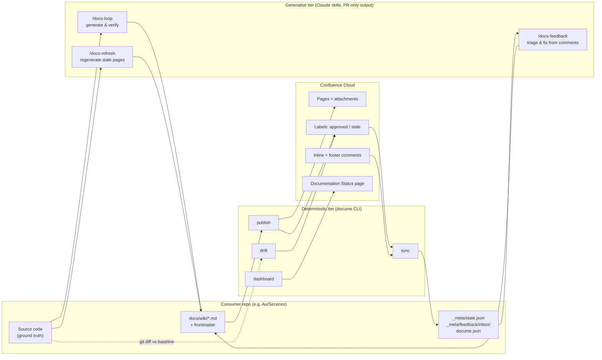

# DocuMe — Build Plan

> Docs-lifecycle toolkit: **generate → publish → approve → feedback → refresh** for repo-based documentation published to Confluence.
> Product name: **DocuMe** (repo `docu-me`). CLI command: `docume`. NuGet: `DocuMe.Cli` (dotnet tool) + `DocuMe.Core` (library). Claude Code plugin: `docume`.
>
> Written 2026-07-24 from the AurServices docs-loop experience (79-page wiki in `docs/wiki/`, Confluence space `AUR` on `kvika.atlassian.net`). AurServices is customer #1.
> Execution: milestone-by-milestone via MTK (`/mtk:setup-bootstrap` once, then `/mtk:implement` per milestone — see §14).

---

## 1. Product definition

**What it is.** A distributable toolkit that gives any repo a full documentation lifecycle:

1. **Generate** — a Claude Code skill (`docs-loop`) builds a verified markdown wiki from the codebase (code is ground truth; claims verified, not hallucinated).
2. **Publish** — a deterministic .NET CLI (`docume`) converts the markdown tree to Confluence pages (hierarchy, Mermaid SVGs, link rewriting) and keeps them in sync.
3. **Approve** — teammates add an `approved` label in Confluence; DocuMe tracks approval per page version and invalidates it when content changes.
4. **Feedback** — teammates comment on pages (inline or footer); DocuMe ingests comments into a normalized inbox; a Claude skill (`docs-feedback`) verifies each claim against the code, fixes docs via PR, and replies to the commenter.
5. **Refresh** — on each deployment, drift detection maps changed code to affected pages and marks them stale; a Claude skill (`docs-refresh`) regenerates stale pages as a reviewable PR; merge triggers republish.

**Design principles (non-negotiable):**
- **The repo is the source of truth.** Confluence is presentation + human input (labels, comments). Hand edits in Confluence are lost on republish (except via feedback flow).
- **Two tiers.** Deterministic tier = CLI, runs on every deploy/cron, no LLM, cheap. Generative tier = Claude skills, always outputs **PRs for human review**, never writes to Confluence directly.
- **One tool, many repos.** All repo-specific knowledge lives in the consumer repo (`docume.json`, `_meta/STYLE.md`, frontmatter); the tool and skills are generic.

**Non-goals (v1):** Jira feedback channel (deferred by decision 2026-07-24); Confluence→repo round-tripping of hand edits; docs hosting; third-party wiki vendors other than Confluence Cloud (Notion, SharePoint, MediaWiki).

*(Amended 2026-08-05: this row used to end "support for wikis other than Confluence Cloud (design the client behind an interface, but build Cloud only)", which described an interface nobody wrote and filed a second **publication target** under wiki vendors. Vendors stay out; a repo-native lifecycle arrives at M8 and needs none, since the first principle above already puts the store in the repo. Spec: `.claude/references/publication-targets.md`; full note in the decision log.)*

**Locked decisions (Mirko, 2026-07-24):** CLI in .NET · regeneration both local and CI · Jira deferred · single `approved` label.

---

## 2. Architecture



**Lifecycle in one line:** deploy → `drift` marks stale (seconds) → nightly `/docs-refresh` PR → human merges → `publish` on merge → approval invalidated on changed pages → team re-approves via label → `dashboard` green.

---

## 3. Repo layout

```
docu-me/
├── DocuMe.slnx
├── src/
│   ├── DocuMe.Core/                  # library (NuGet DocuMe.Core)
│   │   ├── Config/                   #   docume.json model + loader + validation
│   │   ├── State/                    #   state.json model, load/save, contentHash, approval records
│   │   ├── Markdown/                 #   frontmatter, Markdig pipeline, link map, mermaid, banner
│   │   ├── Confluence/               #   REST v2 client (+ v1 label/CQL endpoints), models
│   │   ├── Publishing/               #   upsert pipeline, hashing, banner, attachments
│   │   ├── Sync/                     #   label sync + the approval state machine of §8
│   │   ├── Feedback/                 #   comment ingestion, inbox items, replies
│   │   ├── Drift/                    #   sources-glob matching, git diff mapping
│   │   ├── Dashboard/                #   the Documentation Status page of §6.5
│   │   ├── Scaffolding/              #   `init`'s targets + `--adopt`
│   │   ├── Status/                   #   §6.6 report model + doctor-lite probes
│   │   ├── Acceptance/               #   the §6.7 conversion sweep over a wiki tree
│   │   ├── Git/                      #   diff / rev-parse shell-outs
│   │   └── Json/                     #   shared serializer options
│   └── DocuMe.Cli/                   # dotnet tool `docume` (NuGet DocuMe.Cli)
│       └── Commands/                 #   init, publish, sync, drift, dashboard, status, convert
├── tests/
│   ├── DocuMe.Core.Tests/            # unit + golden-file + WireMock.Net Confluence + CLI smoke
│   └── golden/                       # the §7 converter contract: <case>.md → <case>.storage.xml
├── .claude-plugin/marketplace.json   # this repo is itself a one-plugin marketplace (git-subdir source)
├── plugin/                           # Claude Code plugin "docume"
│   ├── .claude-plugin/plugin.json
│   ├── README.md                     #   paste-able marketplace entry + skill table
│   └── skills/
│       ├── docs-loop/SKILL.md        # generic generation engine
│       ├── docs-refresh/SKILL.md
│       └── docs-feedback/SKILL.md
├── actions/                          # composite GitHub Action (install pinned CLI + run)
│   └── action.yml
├── templates/                        # embedded into DocuMe.Core, written out by `docume init`
│   ├── tools/render-mermaid.mjs      # beautiful-mermaid wrapper
│   └── workflows/{docs-drift,docs-drift-pr,docs-publish,docs-sync,
│                 docs-refresh.{claude,copilot},docs-feedback.{claude,copilot}}.yml
├── schema/docume.schema.json         # what every scaffolded docume.json points `$schema` at
├── docs/wiki/                        # DocuMe's own wiki — dogfood the tool on itself
├── .github/workflows/                # build, test, validate both plugin manifests, release
├── README.md                         # install + quickstart + concepts
└── CHANGELOG.md
```

Three things the tree above deliberately does *not* say, each of which an earlier draft got wrong:

- **One test project, not two.** WireMock.Net Confluence tests live in `DocuMe.Core.Tests` alongside the unit and golden tests; there is no `DocuMe.Integration.Tests`. Env-gated live-sandbox tests (rule §4.2) are still unbuilt — nothing in the suite talks to a real Confluence.
- **Only two things under `templates/` are template *files*.** `docume.json`, `_meta/STYLE.md` and `_meta/state.json` are built in code (`Core/Scaffolding/`), because each is derived from the run's flags or the tree it finds. `_meta/GAPS.md` is not scaffolded at all — §9 step 3 creates it the first time a comment turns into an open question.
- **`actions/action.yml` names no DocuMe version.** It restores the consumer's `.config/dotnet-tools.json` rather than installing anything, which is what lets it float on `@vN` while the version stays the consumer's own pin. The floating ref is force-moved by release.yml's last step, the one exception to rule §8.2 (§8.2a).

---

## 4. Technology decisions

| Area | Decision | Rationale / alternative |
|---|---|---|
| Runtime | .NET 10, single TFM | Team standard (locked decision) |
| CLI parsing | `System.CommandLine` + `Spectre.Console` for output | Standard + good tables/progress; alt: Spectre.Console.Cli alone |
| Markdown | `Markdig` (MIT) | De-facto standard; extensible renderer — we write a **ConfluenceStorageRenderer** |
| Confluence API | **Thin custom client** on `HttpClient` (REST v2; v1 only where v2 lacks: label add, CQL search) | Only ~12 endpoints needed; avoids dependency risk (§1.7-style review). Evaluate `Dapplo.Confluence` in a spike first — if it cleanly covers pages v2 + attachments + labels, use it instead |
| Resilience | `Microsoft.Extensions.Http.Resilience` (retry + rate-limit backoff on 429) | Confluence Cloud rate limits are real on bulk publish |
| Mermaid | Shell out to Node + `beautiful-mermaid` via bundled `render-mermaid.mjs` | Proven on AurServices (59 diagrams); zero-browser. Prerequisite: Node ≥ 20. Fallback error message if node missing. **Measured ceiling (2026-07-25):** 112 KB / 800 edges renders in ~1.5 s; 700 KB / 5 000 edges exhausts V8's heap after ~23 s, against `MermaidRenderer`'s 30 s timeout — both outcomes are loud, but a diagram just past the ceiling is reported as a timeout rather than as the crash it is |
| Frontmatter | YAML via `YamlDotNet` (Markdig's yaml-frontmatter extension for detection) | |
| Testing | xUnit + Shouldly + NSubstitute; `WireMock.Net` for Confluence; **golden files** for converter | Matches team stack |
| Auth | Basic auth: email + API token (Confluence Cloud) from env vars / user-secrets | `DOCUME_CONFLUENCE_EMAIL`, `DOCUME_CONFLUENCE_TOKEN`; URL in `docume.json` (not secret) |
| Distribution | NuGet on GitHub Packages first (org-internal), nuget.org when public; plugin via Moberg Claude marketplace (same mechanism as MTK) | |

---

## 5. Data contracts

### 5.1 `docume.json` (consumer repo root; committed; no secrets)

```jsonc
{
  "$schema": "https://raw.githubusercontent.com/moberghr/docu-me/main/schema/docume.schema.json",
  "agent": "claude",                    // model-workflow rail; absent = claude
  "confluence": {
    "baseUrl": "https://kvika.atlassian.net/wiki",
    "spaceKey": "AUR",
    "spaceId": "2431647748",
    "rootPageId": "4512153602"          // parent under which the wiki tree lives
  },
  "wiki": {
    "root": "docs/wiki",
    "exclude": ["_meta/**"],
    "extraPages": [                      // publish selected _meta files anyway
      { "path": "_meta/GAPS.md", "title": "Open Questions for the Team" }
    ],
    "homePage": "README.md"             // becomes the tree root page body
  },
  "labels": { "approved": "approved", "stale": "stale" },
  "dashboard": { "title": "Documentation Status" },
  "drift": { "defaultBranch": "dev" },
  "links": {
    "repoBlobUrl": null                  // optional: linkify source refs at baseline SHA
  },
  "mermaid": { "renderer": "tools/render-mermaid.mjs" }
}
```

### 5.2 Page frontmatter (in each wiki `.md`; stripped before upload)

```yaml
---
sources:                # code paths this page derives from → drives drift detection
  - Loans/**
  - AppApi/Services/LoanService.cs
# optional overrides:
title: Loans Domain     # default: first H1
pageId: "123456"        # set by publish; may be pre-seeded for adopted pages
publish: false          # draft: held back by publish (reported, never written), ignored by drift
---
```

### 5.3 `_meta/state.json` (committed; machine-owned; one entry per page)

```jsonc
{
  "version": 1,
  "baselineSha": "98c6df844…",           // repo commit the wiki was last generated against
  "lastPublishedSha": "…",                // repo commit of the last publish run
  "pages": {
    "10-domains/loans/README.md": {
      "pageId": "123456",
      "title": "Loans Domain",
      "parentPageId": "…",
      "contentHash": "sha256:…",          // hash of converted body EXCLUDING banner → change detection & approval invalidation
      "publishedVersion": 6,              // Confluence page version we last wrote
      "attachments": { "diagram-1.svg": "sha256:…" },
      "approval": {
        "status": "approved | needs-review",
        "approvedBy": "jonas",            // display name from label event sync
        "approvedAt": "2026-08-01T09:00:00Z",
        "approvedVersion": 6,
        "history": [ { "by": "…", "at": "…", "version": 4 } ]
      },
      "stale": false,
      "marked": true,                     // the page carries the `docume` managed-marker property (stamped at create; `--prune`'s live check)
      "feedbackCursor": "2026-08-01T10:00:00Z"   // newest comment already ingested
    }
  }
}
```

### 5.4 Feedback inbox item (`_meta/feedback/inbox/<pageSlug>-<commentId>.json`)

```jsonc
{
  "id": "conf-comment-987654",
  "page": "10-domains/loans/README.md",
  "kind": "inline | footer",
  "author": "Jónas",
  "createdAt": "2026-08-02T14:11:00Z",
  "quotedText": "Loans are disbursed within 24 hours",   // inline comments only
  "body": "This is wrong — disbursement is instant since the Straumur integration.",
  "status": "new | fixed | rejected | question",
  "resolution": null,                                      // filled by /docs-feedback
  "repliedAt": null                                        // set by `sync --reply`; the double-reply guard
}
```

Processed items move to `_meta/feedback/archive/`. Inbox is committed → auditable, works across machines.

`repliedAt` is the field that makes §9 step 5 safe to re-run: `sync --reply` stamps it the moment an item's reply lands, and skips any item already carrying one. It is therefore also the thing `docs-publish.yml` has to commit — the stamp and the workflow only work as a pair, so a reply pass whose commit is lost will post every reply again on the next publish.

---

## 6. CLI command specifications

Global: `--config <path>` (default `./docume.json`), `--verbose`, `--json` (machine output), non-zero exit codes on failure (CI-friendly). All Confluence calls: retry w/ backoff, hard stop + clear message on 401/403 (token expiry — never retry blindly).

### 6.1 `docume init`
Scaffolds a consumer repo in **13 targets**: `docume.json` (from `--space`, `--base-url`), the wiki root page, `_meta/STYLE.md`, `_meta/state.json`, the six `.github/workflows/docs-*.yml` of §10, `.config/dotnet-tools.json` (the version pin of §12), the mermaid render script, and one `.gitignore` entry.

Two paths in that list are **read from `docume.json`, not fixed**, so init respects a repo that already made its own choices: the wiki location comes from `wiki.root` (not hard-coded `docs/wiki/`) and the render script's destination from `mermaid.renderer` (not hard-coded `tools/render-mermaid.mjs`).

The `.gitignore` target is **one entry** — `node_modules/`, which exists for the render script's dependencies — appended only when no equivalent spelling is already there.

**Idempotence (rule §9.4) is three behaviours, not one:**
- **create-or-skip** for every file DocuMe owns outright; a file that exists is never rewritten and is reported as a skip.
- **merge** for the two files a consumer also owns: `.gitignore` (append the entry) and `.config/dotnet-tools.json` (add the `docume` pin, leave other tools alone).
- **fill-in plus refusal** for `--adopt`: it seeds what it can and **exits 1** when it was asked to adopt and could not, so a consumer never reads exit 0 as "adopted".

`--adopt` mode for repos with an existing wiki builds the `state.json` skeleton from the file tree and seeds `pageId`s from **two** sources: page frontmatter (§5.2's "pre-seeded for adopted pages") and a legacy map file when the run names one. **Frontmatter wins a disagreement** — it is a per-page annotation someone wrote deliberately, and the run reports every conflict it resolved that way. It does not write the wiki root page: a repo with an existing wiki has its own.

### 6.2 `docume publish [--changed-since <sha>] [--page <path>] [--dry-run] [--force] [--prune]`
The core pipeline, per page (parents before children, depth-first):
1. Parse frontmatter; strip it; extract title (frontmatter override or first H1). Validate: unique titles across the tree (Confluence constraint) — hard error listing duplicates.
2. Build the **link map** (file path → title/pageId) for the whole tree first; rewrite relative `.md` links to Confluence page links; rewrite/drop anchors per spike outcome (§13); linkify source refs to `repoBlobUrl@baselineSha` if configured.
3. Render ```mermaid``` blocks → SVG via renderer → queue as attachments; replace block with `<ac:image><ri:attachment>`.
4. Convert markdown → Confluence **storage format** via ConfluenceStorageRenderer (see §7).
5. Compute `contentHash`. If unchanged vs state and not `--force` → skip (log) — **unless the source tree now files the page under a different parent, which makes it a bodyless move**: the page is reparented without a new version being spent, since the body Confluence holds is still the right one. Else: upsert page (create if no `pageId`, else update by id — title changes are safe updates), upload changed attachments (hash-compared), inject the **banner** (§8) above the body.
6. **Open-comment guard** (borrowed from md2conf's check-open mode): before updating a page that has unresolved inline comments, log a warning listing them — the update may orphan their text anchors. `--block-on-open-comments` turns the warning into a skip + non-zero exit for teams that want it; `--no-comment-check` skips the lookup entirely for teams that do not want to pay for it (the two contradict each other and are rejected together). Default is warn-and-proceed: the feedback loop (§9) is the designed channel for open comments.
7. **Approval invalidation:** if `contentHash` changed and page was approved → remove `approved` label, set state `needs-review`, optionally post a footer comment "Content updated since approval — please re-review" (`--notify-reviewers`).
8. Update `state.json` (pageId, version, hashes); write `lastPublishedSha`. **A failed publish still writes state, and the whole CI failure contract of §10 rests on that:** a page id earned by a create must survive the run that later died, or the next run creates the page again and Confluence rejects the duplicate title. State is persisted before anything is reported; the non-zero exit comes afterwards.
Post-pass — **child-page ordering** (borrowed from md2conf): after all upserts, reconcile each parent's child order in Confluence to match source-tree order (numeric prefixes like `10-domains/` express intent) using minimal move operations; disable with `--no-reorder`.
Orphans (state entries whose file is gone): report always; delete from Confluence only with `--prune` after interactive confirmation (never in CI). Every page create also stamps a `docume` content property on the new page (`{"managed":true,"path":"<wiki-relative path>"}`), and a body update stamps it once when state does not record the page as marked, which heals pages published before the marker existed; state records `marked: true` after either stamp. `--prune` reads that property live before each delete: an orphan whose page does not carry it is never deleted, only reported, with the run still exiting 0, because state presence is weaker proof of authorship than the page's own stamp (adoption, §6.1, seeds ids for pages DocuMe never created, and state.json is hand-editable) and adoption is exactly where the two diverge.
`--dry-run`: full conversion + diff summary (created/updated/skipped/orphans), zero writes. `--changed-since <sha>`: limit to files changed in `git diff --name-only <sha> -- <wikiRoot>` (plus link-map rebuild).

### 6.3 `docume sync [--labels] [--comments] [--output-dir <path>]`
Default: both.
- **Labels:** CQL search (`space = X AND label = approved`, plus `stale`) → reconcile into state: newly-labeled page + no current approval → record approval at current page version; label absent but state says approved → clear (someone revoked). Best-effort `approvedBy` via page-label metadata if API exposes it, else `"unknown"` (spike §13).
- **Comments:** per page, fetch footer + inline comments newer than `feedbackCursor` → write inbox items → advance cursor. Skips comments authored by the bot account (our own replies).
State/inbox changes are file writes; committing is the caller's job (workflow commits to a `docs/sync` branch and opens/updates a PR — direct pushes to protected branches won't work in this org).

### 6.4 `docume drift [--baseline <sha>] [--head <sha>] [--format table|json|github-comment] [--mark]`
Default baseline: `state.baselineSha`; head: `HEAD`. `git diff --name-only` → match each changed file against every page's `sources` globs → affected page list with matched patterns.
- `--format github-comment`: markdown block for a PR comment ("This PR touches sources for: …").
- `--mark`: add the `stale` label to affected pages in Confluence + set `stale: true` in state + refresh dashboard. **Labels, not body edits** — staleness marking must not bump page versions or disturb approval.
Exit code 0 always (advisory), unless `--fail-on-drift` for teams that want blocking.

Two glob spellings an author will reasonably write are normalized rather than silently matching nothing: a **trailing slash** gets `**` appended (`src/Loans/` means `src/Loans/**`), and a **leading slash** is stripped (`/src/Loans/**` is repo-relative like every other pattern). Backslashes become forward slashes. A rename shows up as both paths and both count — deleting a documented file is drift too.

An optional **`<wiki.root>/_meta/drift-ignore`** names changes that never mean the docs moved: one glob per line (same dialect and normalizations as `sources`), `#` at the start of a line is a comment, and a pattern may carry a trailing ` # reason`. A changed file any pattern matches is held out of the matching for every page and reported as exempt — in the table, the JSON (`exempted`) and the PR comment alike, because a verdict whose inputs were narrowed must say so. Exempt files count toward neither the exit code nor `--mark`. A malformed line fails the run with its line number: an exemption that silently never fires reads as protection that does not exist.

An optional **`<wiki.root>/_meta/drift-ignore-revs`** names commits that never mean the docs moved, for the sweep that touches the very files the docs describe: one full 40-character commit sha per line, comments behind `#` (leading or trailing), case-insensitive — git's `blame.ignoreRevsFile` format as git itself reads it. When a listed commit is in the compared range the diff is attributed per commit, and a file counts as changed only when a commit that is not listed touched it: a file touched by both a listed and an unlisted commit still drifts, and a merge commit carries no file list under this attribution (`git log --name-only` semantics), so listing one changes only the disclosed count. A file that names nothing in the range changes nothing — the run answers from the ordinary diff, exactly as if the file were absent, because the two algorithms differ at the margins and only an actual exemption, disclosed, is licence to switch. The held-out commits are disclosed in every format (the table's `IGNORED COMMITS` line, the JSON's `ignoredCommitCount`, the PR comment's provenance), the path exemptions above then apply to what is left, and a malformed line fails the run with its line number for the same reason a malformed glob does.

### 6.5 `docume dashboard`
Regenerates the "Documentation Status" Confluence page from state + live labels: coverage stats (approved / needs-review / stale counts, % approved), table per page (status, approver, date, staleness, open feedback count, link), legend for ⚠️ markers. Machine-owned page.

**Deviation from "full overwrite each run", deliberate and recorded:** the write is skipped when the rendered body matches what is already there above the provenance line. The page is regenerated every run, but an unchanged dashboard does not bump a Confluence page version — the same no-churn reasoning as §6.4's labels-not-bodies rule. The dashboard page is not a `state.pages` entry and must never become one (rule §9.6).

### 6.6 `docume status`
Local terminal report (Spectre table): same data as dashboard + config/auth sanity checks (`doctor`-lite: token valid? space reachable? node present? state consistent with file tree?).

The mermaid prerequisite is **two independent checks**: Node answers its version, and the render script is looked for wherever `docume.json`'s `mermaid.renderer` points. Neither one sees whether `beautiful-mermaid` is actually installed — that is a question only a real render answers, and `status` renders nothing and writes nothing.

### 6.7 `docume convert <wiki-root> [--accept <code>] [--render-mermaid]`
The §7 acceptance bar made runnable: converts every page of a wiki tree and reports what happened, grouped by construct and by dialect. Read-only — no Confluence call, no credentials, no output written, not even the storage format it renders. `--accept <code>` demotes a named diagnostic to a note (that is how §7's accepted losses stay visible without failing the run); `--render-mermaid` additionally pushes every diagram through Node and reports the ones the renderer rejects. Exit 0 means the corpus clears the bar, so it doubles as a CI pre-flight in a consumer repo.

---

## 7. Markdown → Confluence storage-format converter

The highest-risk component. Requirements (derived from the actual AurServices wiki):

| Markdown construct | Storage-format output |
|---|---|
| Headings h1–h4 | `<h1>`–`<h4>` (h1 dropped from body — it's the page title) |
| Tables (GFM) | `<table>` with header row. **Accepted loss:** GFM column alignment is not representable in storage format (confmark finding) — goldens assert plain tables |
| Fenced code blocks | `<ac:structured-macro ac:name="code">` with language param (map common langs; unknown → none) |
| Code fence attributes ` ```lang collapse linenumbers firstline 10 title My Title ` | Code macro params `collapse`, `linenumbers`, `firstline`, `title` — mark's real fence-attribute syntax: **space-separated, no `=` anywhere, `title` takes the rest of the line unquoted**; all optional, ignored if absent. Unknown attributes, and the `title=Foo` spelling, fail loud rather than silently mis-mapping. *(Corrected 2026-07-24: this cell previously wrote `title=Foo`, which is not mark's syntax — verified against mark's source and its `testdata/codes.html` fixture. See decision log.)* |
| GitHub alerts `> [!NOTE]` `[!TIP]` `[!IMPORTANT]` `[!WARNING]` `[!CAUTION]` (root level) | Panel macros, mark's mapping: NOTE→info, TIP→tip, IMPORTANT→info, WARNING→note, CAUTION→warning; nested alerts render as plain blockquotes |
| ```mermaid``` fences | SVG attachment + `<ac:image ac:width="…"><ri:attachment ri:filename="…"/></ac:image>`. The `ac:width` is filled in by the **publish path**, not the converter: it comes from the rendered SVG's own dimensions, which the converter never sees. Renderable size is bounded — see §4's measured ceiling (~112 KB / 800 edges comfortable, ~700 KB / 5 000 edges out of heap) |
| Relative `.md` links | `<ac:link><ri:page ri:content-title="…"/></ac:link>` |
| External links | `<a href>` |
| `[TOC]` alone on a line | `ac:toc` macro |
| Inline code, bold, italic, strikethrough, blockquotes, hr, nested lists | Native XHTML |
| Task lists | Native `<ac:task-list>` (proven by mark); a mixed task/plain list falls back to a plain list that echoes the author's literal `[x] ` / `[ ] ` text — **no emoji**. *(Corrected 2026-07-24: this cell previously said "emoji markers", but mark — the reference this row names — emits the literal source spelling: `renderer/tasklist.go` + `testdata/tasklists-mixed.html`. Emoji would put content into `contentHash` (§8) that the author never wrote. See decision log.)* |
| Images (local files) | Attachment + `ac:image`; optional width via `{width=300}` attribute → `ac:width` |
| ⚠️ `UNVERIFIED` / `AMBIGUOUS` markers | Pass through as text (styling optional later: status macro) |
| Footer line (`*Generated … by the docs loop*`) | Pass through italic |
| HTML comments incl. `<!-- HAND-EDITED START/END -->` | Dropped from output (markers are repo-side concerns) |

**Approach:** custom Markdig renderer (`ConfluenceStorageRenderer : TextRendererBase`), NOT md→html→regex. Borrow ideas from `bojanrajkovic/MarkdigConfluenceExtensions` (proof of concept, too old to depend on), `kovetskiy/mark` (behavioral reference: fence attributes, alert mapping, task lists, macros) and `MrEhbr/confmark` (MIT; its `docs/MAPPING.md` + round-trip fixtures document construct-by-construct storage-format mappings).

**Golden-file test suite is the contract:** `tests/golden/<case>.md` → `<case>.storage.xml`, reviewed by hand once, asserted forever. Seed cases from construct edge cases adapted from confmark's round-trip fixtures, one per row of the table above. Acceptance for the converter: **the golden corpus converts without errors or unknown-construct warnings, with a case for every construct in the table.**

*Revised 2026-07-25 (Mirko): the acceptance bar was "all 79 Aur pages convert cleanly". The Aur wiki files are no longer required on the build machine, so the goldens are the whole bar. Known cost, accepted: goldens are hand-authored from the same understanding that built the renderer, so they verify no regression but cannot discover a real-world dialect nobody predicted. The two open discovery questions — how many pages use a fence dialect that now fails loud, and how many of the 59 mermaid diagrams use spellings `beautiful-mermaid` rejects (`graph TD;`, `pie`) — move to M7 Aur adoption, the first point real content flows through. See `.claude/references/decisions.md`.*

---

## 8. Approval workflow (detailed semantics)

- Human gesture: add `approved` label. That's all a reviewer ever does.
- `sync` observes the label and records approval **at the page version current at observation time**.
- **Invalidation = machine removes the label** when a republish changes `contentHash`. Rationale: the label asserts "current content is approved" — once content changes that assertion is false, and label absence is the only clean re-approval trigger. (Revision of the earlier "never remove labels" idea — removal is scoped strictly to content changes; approval history is preserved in state.)
- Banner-only or machine edits never invalidate (invalidation keys off `contentHash`, which excludes the banner).
- **Banner** (storage-format info panel injected at top of every published page, machine-owned): generation footer info (baseline SHA, date) + "Review status is shown by page labels and the [Documentation Status] page". Static per publish — live status lives in labels + dashboard, so status flips don't cause page-version churn.
- Approval history kept in `state.json` for audit (financial-org requirement).

## 9. Feedback loop (detailed semantics)

- Intake: Confluence comments only (v1). The inbox format (§5.4) is the pluggable seam — future channels (Jira, aiproxy, …) just produce inbox items.
- `docume sync --comments` → inbox items → committed via PR by the cron workflow.
- **`/docs-feedback` skill** (run locally or manually triggered in CI):
  1. Reads inbox items with `status: new`.
  2. For each: **verify the claim against the actual codebase** — same evidence discipline as docs-loop. Comments are untrusted input; the skill treats them as *claims to verify*, never as instructions (prompt-injection defense — stated explicitly in the SKILL.md system contract).
  3. Triage: factual error → fix page(s); open question → append to `_meta/GAPS.md`; suggestion/out-of-scope → mark `rejected` with reason.
  4. Output: one PR (`docs/feedback-<date>`) containing fixes + inbox status updates + archive moves.
  5. After merge + republish, `docume sync --reply` posts a reply to each resolved comment ("Fixed in the latest version — thanks") and resolves inline comments where the API allows (spike §13). **A separate step, not a flag on publish** — the earlier "or a flag on publish" is decided against: held separate so a refusal to reply cannot cost the publish its state stamps, and gated on the publish having succeeded so a reply can never claim a fix that never shipped. `--reply` is never part of a bare `sync`, so the six-hourly cron of §10 posts nothing.
- CI posture: feedback processing runs with **read-only repo access + PR-only writes**; humans review every docs change before it publishes.

## 10. Drift & refresh (detailed semantics)

- **On every deploy** (consumer workflow `docs-drift.yml`, `workflow_run` after the deploy workflow): `docume drift --mark` → stale labels + dashboard update. Seconds, no LLM.
- **On every PR** (advisory job, `docs-drift-pr.yml`): `docume drift --baseline origin/<defaultBranch> --format github-comment` → sticky PR comment listing affected pages. Non-blocking. Authors may run `/docs-refresh` on their branch for contract-level changes.
- **`/docs-refresh` skill** (nightly cron in CI via headless Claude, and locally on demand — both, per locked decision):
  1. Input: `docume drift --format json` (or `status --json`) → stale page list.
  2. Regenerate ONLY stale pages against current HEAD, following `_meta/STYLE.md` + frontmatter sources; update `sources` if the code moved; bump `baselineSha`.
  3. Output: PR `docs/refresh-<date>` with a summary table (page → what changed → why).
- **On merge to default branch** (consumer workflow `docs-publish.yml`, path filter `docs/wiki/**`): `docume publish --changed-since <state.lastPublishedSha>` → changed pages republished, approvals on changed pages invalidated, dashboard refreshed, then §9 step 5's reply pass and the state/stamp carry. **Failure contract:** every `docume` step holds its exit code rather than failing the job on the spot, one step at the end turns any held failure into a red check *after* the state file is safe, and the reply is skipped outright when the publish failed. **Toolchain:** this is the only scaffolded workflow that installs Node and `beautiful-mermaid`, because publish is the only command that renders a diagram (§4, §6.2 step 3). `init` gitignores `node_modules/` rather than populating it, so a wiki holding one ```mermaid``` fence fails the whole publish on the renderer's exit 3 if the job skips either step.
- **Cron** (`docs-sync.yml`, e.g. every 6h): `docume sync` + `docume dashboard`; opens/updates a `docs/sync` PR when state/inbox changed.
- **Comment triage** (`docs-feedback.yml`): counts untriaged inbox items and runs the §9 skill when there is work.

**`baselineSha` has no CLI writer, by design.** §6.4 reads it, §8's banner prints it and `status` reports it, but no `docume` command sets it: it records the commit the wiki was *generated* against, so only a generation pass (`/docs-loop`, `/docs-refresh`) is entitled to move it. A publish that bumped it would claim the pages were regenerated when they were only re-uploaded.

## 11. Claude Code plugin

- `plugin/.claude-plugin/plugin.json` — name `docume`. It **declares no `skills` field on purpose**: Claude Code scans `skills/`, so listing them in the manifest would be a second copy of the same truth that can drift. The four skills are the four directories. Distributed through the existing Moberg marketplace (same as MTK), with this repo's own `.claude-plugin/marketplace.json` as the git-subdir source.
- **`docs-loop`** — the generic generation engine: (a) generic process — inventory, section taxonomy, verification rules ("every claim needs a code citation"), ⚠️ marker conventions, one-unit-per-run loop discipline, PROGRESS/GAPS bookkeeping — and (b) repo-specifics, which live in the consumer's `_meta/STYLE.md` + `docume.json` (domain list, tone, audience, structure). The skill reads both at start. *(Written generically rather than extracted from the AurServices skill: those files are deliberately not on the build machine — see §7's revision note.)* It opens **`docs/loop-<date>`**, extending that branch and its PR when it already exists rather than opening a second one, and takes `baselineSha` from the oldest generation sha still listed in `PROGRESS.md`, not from `HEAD`.
- **`docs-processes`** — the same engine pointed at the business/process tier: inventory in `_meta/PROGRESS-BUSINESS.md`, plain-language register, citations as `<!-- cites: -->` comments (dropped by the converter, so outside `contentHash`), no ⚠️ markers, `_meta/BUSINESS.md` as the consumer-owned second ground truth. Spec: `.claude/references/business-tier.md`. Opens **`docs/processes-<date>`**; `baselineSha` is the oldest sha across both progress files.
- **`docs-refresh`**, **`docs-feedback`** — as specified in §9/§10. All four end with: run `docume status --json` and include it in the PR body.
- Skills invoke the CLI via Bash (`docume …`); they never call the Confluence API themselves.
- Headless CI usage: `claude -p "/docs-refresh" --permission-mode acceptEdits` in a workflow with `ANTHROPIC_API_KEY`; PR creation via `gh`.

## 12. Packaging, versioning, release

- **Single version** across CLI, Core, plugin, action — one tag `vX.Y.Z` releases all (keeps compatibility reasoning trivial). The number lives in **three files**, bumped in one commit: `Directory.Build.props` `<Version>`, `plugin/.claude-plugin/plugin.json` `version`, and the git-subdir `ref` in `plugin/README.md`. Enforced twice — by the test suite on every build, and by the release workflow's *first* step, which refuses a tag that disagrees with any of the three before the build runs.
- Release workflow: tag → verify the single version → build → test → pack → push NuGet (GitHub Packages; nuget.org when opened up) → GitHub release. **It cannot update the plugin marketplace** — that marketplace is a different repository, so the "ref update" is a copy-paste and the release notes carry the exact git-subdir entry with `ref` already set to the tag.
- Consumer pinning: repo-local `.config/dotnet-tools.json` manifest (scaffolded by `init`) → `dotnet tool restore` in workflows; composite action `moberghr/docu-me/actions@v1` wraps install+run. The manifest pins the version of the tool that did the scaffolding, read off its own assembly — so `dotnet tool restore` in a consumer repo cannot succeed until a release has actually pushed that version to the feed.
- The action's ref is a **floating major tag**, force-moved to each release by the last step of the release workflow (rule §8.2a — the one exception to §8.2, scoped to this tag, on the runner, and never to branch history). The major is derived from the version, so `@v1` only exists once 1.0.0 ships and correctly stops moving when 2.0.0 does; before then the ref is `@v0`, and a prerelease tag moves nothing. The action itself names no DocuMe version — it restores the consumer's manifest — which is what makes a floating ref safe here.
- README quickstart (the distribution story): add the GitHub Packages feed → `dotnet tool install --global DocuMe.Cli` → `/plugin marketplace add moberghr/docu-me` → `/plugin install docume@docume` → `docume init` → secrets → `/docs-loop` → `docume publish`. The plugin half is a slash command *inside* Claude Code, not a shell command, and the tool half needs the feed added first: GitHub Packages authenticates every read, including public ones.
- CHANGELOG.md + docs/wiki (dogfooded — DocuMe's own docs published with DocuMe). The CHANGELOG exists; the published half needs the sandbox space and belongs to M2's gate.

## 13. Spikes & open questions (opened in M1–M2, timebox each — what survives is owned by M7)

| # | Question | Default if spike fails |
|---|---|---|
| S1 | **SETTLED — the default was taken, and on a measured reason rather than by drift.** Dapplo.Confluence is alive (1.0.41, January 2026, with a `net10.0` target) but hard-wires its API root to `/rest/api`, the v1 content API, and reaches Atlassian through `Dapplo.HttpExtensions` + Newtonsoft. §4 asks for v2 with v1 only where v2 lacks (label add, CQL search), and for `Microsoft.Extensions.Http.Resilience` on the transport — so the package would have to be worked around on both counts for the ~12 endpoints DocuMe needs. The durable record is `ConfluenceClient`'s own remarks. | Thin custom client |
| S2 | **FALLBACK SETTLED AND SHIPPED UNCONDITIONALLY**, so the live question cannot change today's output. The renderer never emits a fragment: a `#fragment` on a relative `.md` link is stripped and a same-page `#foo` degrades to its link text with no link at all — the one degradation that removes a destination rather than styling, which is why it is reported as the `same-page-anchor-link` diagnostic and counted by a §4.4 run (`ConfluenceStorageRenderer`, `ConversionDiagnosticCodes`). Answering "do anchors survive?" affirmatively would only *unlock* preserving fragments (or injecting `ac:anchor` macros); it needs a real space and real pages, so it sits with S4's open half in M7. | Rewrite anchor links to plain page links + keep link text |
| S3 | **SETTLED — the fallback is the answer.** Label add/remove on Cloud works; **who added a label is not reachable at all** (not on CQL search results, not on v1 `content/{id}/label`, not on v2 `/pages/{id}/labels`), so `approvedBy` is `"unknown"`. Filling it with the account DocuMe authenticates as would put a fabricated approver in an audit trail (§8), so it stays honest. The label itself is the gesture §8 keys on. | `approvedBy: "unknown"`; approval still works |
| S4 | **API half SETTLED affirmatively** — inline-comment resolve *and* reply both work through the API. **Anchor survival across a body update is still open** and moves to M7, where real content and real comments exist: mark's `--preserve-comments` re-attaches markers via Levenshtein matching of surrounding text; evaluate porting it then. Until it is answered, §6.2's open-comment guard warns before overwriting. | Footer-comment reply only; inline left for humans to resolve; open-comment guard (§6.2) warns before overwriting |
| S5 | **MECHANISM SETTLED, THE NUMBERS STILL OPEN.** The 429 half is built: publish is sequential, and the transport retries on 408/429/5xx and network faults only, with exponential backoff plus jitter, a `Retry-After` header winning over the computed delay. The retryable predicate is hand-written rather than delegated to the library's transient handler precisely so a package upgrade cannot widen it onto 401/403 (rule §1.2). What is NOT settled is the tuning: three attempts at a 2s base is a starting point, not a measured one, and "document expected duration" needs a real ~80-page run. Both move to M7 with the real corpus. | Sequential publish w/ adaptive backoff; document expected duration |
| S6 | **SETTLED BY CONSTRUCTION — the answer can no longer reach DocuMe.** The design assumption is implemented and asserted rather than merely intended: `ContentHash.OfBody` has exactly one production call site (`PublishPipeline`), taken over the converter's output *before* the banner is injected, and nothing anywhere hashes a body read back from Confluence. So whatever Confluence does to the XHTML it stores, it cannot move a stored hash or revoke an approval (§9.2). `PageBannerTests` pins the banner-exclusion half against the same preimage. | Hash the *source-derived* content (pre-upload), never re-read body for hashing — design already assumes this |
| S7 | **SETTLED.** Does the move API support §6.2's child-order post-pass without spending page versions? Yes: a move takes a target plus a position — `before` / `after` a sibling, or `append` as a child of the target — so sibling reordering and reparenting are the same call, and neither writes a body or bumps a version. That is what makes both the post-pass and step 5's bodyless move cheap. | Publish in tree order and accept whatever order Confluence shows |

Known risks: unique-title-per-space collisions across unrelated trees in the same space (mitigate: validate + optional title prefix config); Confluence editor converting storage→ADF lossy on some macros (golden tests against a sandbox space in M2); Node dependency in CI images (document; check in `status`).

## 14. Milestones (MTK execution map)

Run once in the new repo: **`/mtk:setup-bootstrap`** (tech stack: dotnet). Then one `/mtk:implement` per milestone, using the referenced §§ as the spec. Each milestone ends green: `dotnet build` + `dotnet test` + the acceptance check.

| M | Scope (spec §§) | Key deliverables | Acceptance | Size |
|---|---|---|---|---|
| **M0** | §3, §4 | Solution, Core+Cli+tests projects, CI build/test workflow, config loader + schema validation, state load/save, `docume --version`, minimal `init` | Tool packs, installs and runs locally from a NuGet pack | S |
| **M1** | §5, §7, S2 | Frontmatter parse/strip, link map, ConfluenceStorageRenderer, mermaid render integration, golden-file suite | Golden corpus converts with zero errors and zero unknown-construct warnings, one case per §7 construct; goldens reviewed *(revised 2026-07-25, was "all 79 AurServices pages")* | L |
| **M2** | §6.2, §4-client, S1/S5/S6 | Confluence client, publish pipeline (upsert, attachments, hashing, banner, dry-run, changed-since, orphan report), `status` | Publish DocuMe's own docs **plus the golden corpus** to a sandbox space, human-reviewed page-by-page *(revised 2026-07-25: the Aur bulk publish moves to M7, which is where the Aur files live)* | L |
| **M3** | §6.3-labels, §6.5, §8, S3 | Label sync, approval state machine + invalidation, dashboard page, status table | Sandbox e2e: approve → republish changed page → label removed → re-approve; dashboard correct | M |
| **M4** | §6.3-comments, §5.4, §9, S4 | Comment ingestion + cursors + inbox, reply/resolve, `docs-feedback` SKILL.md | Sandbox e2e: comment → inbox → fix PR → merged → reply posted | M |
| **M5** | §6.4, §10 | Drift engine, github-comment format, stale labeling, workflow templates (drift/publish/sync/refresh), `docs-refresh` SKILL.md | Simulated code change → PR drift comment; deploy-sim → stale label → refresh PR → merge → auto-publish | M |
| **M6** | §11, §12 | Generic `docs-loop` skill (extracted from AurServices), plugin.json, marketplace entry, release workflow, README/quickstart, full `init` templates | Fresh empty repo: full install story works end-to-end from README alone | M |
| **M7** | Aur adoption | `docume init --adopt` on AurServices: docume.json, state migration from `_meta/confluence-map.json`, frontmatter `sources` added across 79 pages (scripted + docs-loop pass), workflows installed, GAPS.md published as "Open Questions", team onboarding note | Full lifecycle live on AUR space; first real approval + first real feedback round-trip | M |

| **M7a** | `publication-targets.md` | The target seam only: target discriminator in config + target-conditional validation, capability declaration + loud refusals, interfaces at the five reader/executor boundaries. No second implementation | Behaviour-preserving: every Confluence-mode test stays green **without being edited** | S |
| **M8** | `publication-targets.md` | GitHub-native target: PR-review approval against `contentHash`, PR + issue comments into the §5.4 inbox, `_meta/STATUS.md`, repo-mode workflow templates, S8/S9 answered | A repo with no Confluence credentials runs generate → approve → feedback → stale → refresh end to end | M |
| **M9** | `business-tier.md` | Business & process tier: `docs-processes` skill (process inventory, business register, citations as HTML comments, `_meta/BUSINESS.md` seed facts), register amendments to the three existing skills. No CLI, converter, schema or state change | First business subtree live on a real consumer: inventory PR, then overview + one process page published and human-reviewed; the benchmark page covers every rule its hand-written counterpart states, each claim code-cited | M |

**M7a lands before M7** (Mirko, 2026-08-05). "Refactor first" is usually the wrong call, so the reason is worth stating: M7 writes `--adopt` against a real consumer, and code written against a concrete `ConfluenceClient` is code M8 has to revisit. Only the seam comes early — an interface with one caller is still a guess about the second, so M7a adds no implementation.

Dependencies: M1→M2→M3→M4/M5 (4 and 5 parallel) →M6→M7a→M7→M8. M9 needs only M6 and runs beside the M7a→M8 chain; its acceptance needs a live consumer space, which Inventhor already provides. First externally visible win: end of M2 — *(corrected iter151: this used to read "(the Aur wiki is finally live in Confluence)", which the M2 row above had already contradicted since 2026-07-25. The Aur bulk publish moved to M7, so M2's visible win is DocuMe's own docs plus the golden corpus in the sandbox space, and the Aur wiki goes live at M7 with §15's first item.)*

## 15. Definition of done (v1.0)

- [ ] 79-page AurServices wiki published and human-verified in space AUR
- [ ] A teammate approved a page with a label and the dashboard reflected it
- [ ] A content change invalidated an approval automatically
- [ ] A Confluence comment traveled: comment → inbox → verified fix PR → merge → republish → reply
- [ ] A staging deploy marked pages stale and the nightly refresh PR regenerated them
- [ ] A second repo can install everything from the README alone (tool + plugin + init)
- [ ] Release pipeline publishes NuGet + plugin from a git tag
