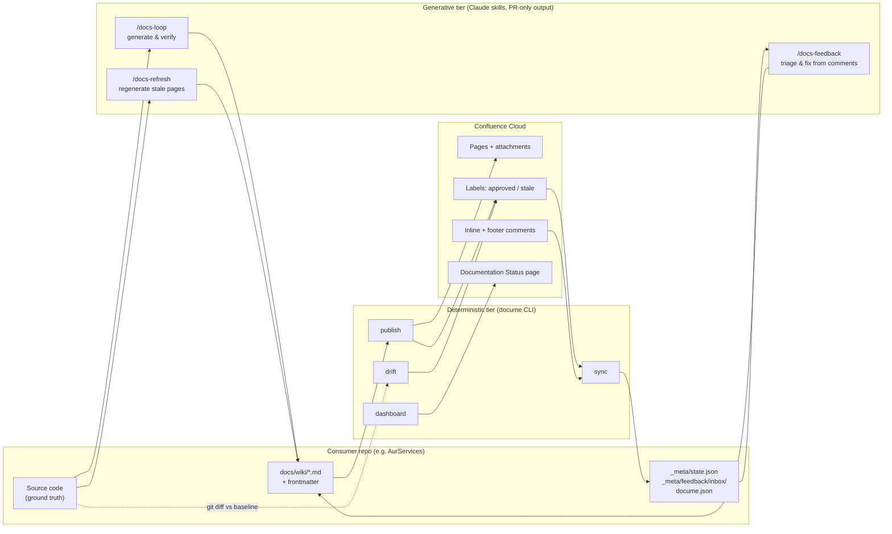

# DocuMe — Build Plan

> Docs-lifecycle toolkit: **generate → publish → approve → feedback → refresh** for repo-based documentation published to Confluence.
> Product name: **DocuMe** (repo `docu-me`). CLI command: `docume`. NuGet: `DocuMe.Cli` (dotnet tool) + `DocuMe.Core` (library). Claude Code plugin: `docume`.
>
> Written 2026-07-24 from the AurServices docs-loop experience (79-page wiki in `docs/wiki/`, Confluence space `AUR` on `kvika.atlassian.net`). AurServices is customer #1.
> Execution: milestone-by-milestone via MTK (`/mtk:setup-bootstrap` once, then `/mtk:implement` per milestone — see §14).

---

## 1. Product definition

**What it is.** A distributable toolkit that gives any repo a full documentation lifecycle:

1. **Generate** — a Claude Code skill (`docs-loop`) builds a verified markdown wiki from the codebase (code is ground truth; claims verified, not hallucinated).
2. **Publish** — a deterministic .NET CLI (`docume`) converts the markdown tree to Confluence pages (hierarchy, Mermaid SVGs, link rewriting) and keeps them in sync.
3. **Approve** — teammates add an `approved` label in Confluence; DocuMe tracks approval per page version and invalidates it when content changes.
4. **Feedback** — teammates comment on pages (inline or footer); DocuMe ingests comments into a normalized inbox; a Claude skill (`docs-feedback`) verifies each claim against the code, fixes docs via PR, and replies to the commenter.
5. **Refresh** — on each deployment, drift detection maps changed code to affected pages and marks them stale; a Claude skill (`docs-refresh`) regenerates stale pages as a reviewable PR; merge triggers republish.

**Design principles (non-negotiable):**
- **The repo is the source of truth.** Confluence is presentation + human input (labels, comments). Hand edits in Confluence are lost on republish (except via feedback flow).
- **Two tiers.** Deterministic tier = CLI, runs on every deploy/cron, no LLM, cheap. Generative tier = Claude skills, always outputs **PRs for human review**, never writes to Confluence directly.
- **One tool, many repos.** All repo-specific knowledge lives in the consumer repo (`docume.json`, `_meta/STYLE.md`, frontmatter); the tool and skills are generic.

**Non-goals (v1):** Jira feedback channel (deferred by decision 2026-07-24); Confluence→repo round-tripping of hand edits; docs hosting; support for wikis other than Confluence Cloud (design the client behind an interface, but build Cloud only).

**Locked decisions (Mirko, 2026-07-24):** CLI in .NET · regeneration both local and CI · Jira deferred · single `approved` label.

---

## 2. Architecture



**Lifecycle in one line:** deploy → `drift` marks stale (seconds) → nightly `/docs-refresh` PR → human merges → `publish` on merge → approval invalidated on changed pages → team re-approves via label → `dashboard` green.

---

## 3. Repo layout

```
docu-me/
├── DocuMe.slnx
├── src/
│   ├── DocuMe.Core/                  # library (NuGet DocuMe.Core)
│   │   ├── Config/                   #   docume.json model + loader + validation
│   │   ├── State/                    #   state.json model, load/save, migration
│   │   ├── Markdown/                 #   frontmatter, Markdig pipeline, link map, mermaid
│   │   ├── Confluence/               #   REST v2 client (+ v1 label/CQL endpoints), models
│   │   ├── Publishing/               #   upsert pipeline, hashing, banner, attachments
│   │   ├── Approval/                 #   approval state machine
│   │   ├── Feedback/                 #   comment ingestion, inbox items, replies
│   │   └── Drift/                    #   sources-glob matching, git diff mapping
│   └── DocuMe.Cli/                   # dotnet tool `docume` (NuGet DocuMe.Cli)
│       └── Commands/                 #   init, publish, sync, drift, dashboard, status
├── tests/
│   ├── DocuMe.Core.Tests/            # unit + golden-file converter tests
│   └── DocuMe.Integration.Tests/     # WireMock.Net Confluence; opt-in live sandbox tests
├── plugin/                           # Claude Code plugin "docume"
│   ├── .claude-plugin/plugin.json
│   └── skills/
│       ├── docs-loop/SKILL.md        # generic generation engine
│       ├── docs-refresh/SKILL.md
│       └── docs-feedback/SKILL.md
├── actions/                          # composite GitHub Action (install pinned CLI + run)
│   └── action.yml
├── templates/                        # scaffolded by `docume init` into consumer repos
│   ├── docume.json
│   ├── docs/wiki/_meta/{STYLE.md,GAPS.md,state.json}
│   ├── tools/render-mermaid.mjs      # beautiful-mermaid wrapper (from AurServices)
│   └── workflows/{docs-drift.yml,docs-publish.yml,docs-sync.yml,docs-refresh.yml}
├── docs/wiki/                        # DocuMe's own wiki — dogfood the tool on itself
├── .github/workflows/                # build, test, release (NuGet + plugin tag)
├── README.md                         # install + quickstart + concepts
└── CHANGELOG.md
```

---

## 4. Technology decisions

| Area | Decision | Rationale / alternative |
|---|---|---|
| Runtime | .NET 10, single TFM | Team standard (locked decision) |
| CLI parsing | `System.CommandLine` + `Spectre.Console` for output | Standard + good tables/progress; alt: Spectre.Console.Cli alone |
| Markdown | `Markdig` (MIT) | De-facto standard; extensible renderer — we write a **ConfluenceStorageRenderer** |
| Confluence API | **Thin custom client** on `HttpClient` (REST v2; v1 only where v2 lacks: label add, CQL search) | Only ~12 endpoints needed; avoids dependency risk (§1.7-style review). Evaluate `Dapplo.Confluence` in a spike first — if it cleanly covers pages v2 + attachments + labels, use it instead |
| Resilience | `Microsoft.Extensions.Http.Resilience` (retry + rate-limit backoff on 429) | Confluence Cloud rate limits are real on bulk publish |
| Mermaid | Shell out to Node + `beautiful-mermaid` via bundled `render-mermaid.mjs` | Proven on AurServices (59 diagrams); zero-browser. Prerequisite: Node ≥ 20. Fallback error message if node missing |
| Frontmatter | YAML via `YamlDotNet` (Markdig's yaml-frontmatter extension for detection) | |
| Testing | xUnit + Shouldly + NSubstitute; `WireMock.Net` for Confluence; **golden files** for converter | Matches team stack |
| Auth | Basic auth: email + API token (Confluence Cloud) from env vars / user-secrets | `DOCUME_CONFLUENCE_EMAIL`, `DOCUME_CONFLUENCE_TOKEN`; URL in `docume.json` (not secret) |
| Distribution | NuGet on GitHub Packages first (org-internal), nuget.org when public; plugin via Moberg Claude marketplace (same mechanism as MTK) | |

---

## 5. Data contracts

### 5.1 `docume.json` (consumer repo root; committed; no secrets)

```jsonc
{
  "$schema": "https://raw.githubusercontent.com/moberg/docu-me/main/schema/docume.schema.json",
  "confluence": {
    "baseUrl": "https://kvika.atlassian.net/wiki",
    "spaceKey": "AUR",
    "spaceId": "2431647748",
    "rootPageId": "4512153602"          // parent under which the wiki tree lives
  },
  "wiki": {
    "root": "docs/wiki",
    "exclude": ["_meta/**"],
    "extraPages": [                      // publish selected _meta files anyway
      { "path": "_meta/GAPS.md", "title": "Open Questions for the Team" }
    ],
    "homePage": "README.md"             // becomes the tree root page body
  },
  "labels": { "approved": "approved", "stale": "stale" },
  "dashboard": { "title": "Documentation Status" },
  "drift": { "defaultBranch": "dev" },
  "links": {
    "repoBlobUrl": null                  // optional: linkify source refs at baseline SHA
  },
  "mermaid": { "renderer": "tools/render-mermaid.mjs" }
}
```

### 5.2 Page frontmatter (in each wiki `.md`; stripped before upload)

```yaml
---
sources:                # code paths this page derives from → drives drift detection
  - Loans/**
  - AppApi/Services/LoanService.cs
# optional overrides:
title: Loans Domain     # default: first H1
pageId: "123456"        # set by publish; may be pre-seeded for adopted pages
---
```

### 5.3 `_meta/state.json` (committed; machine-owned; one entry per page)

```jsonc
{
  "version": 1,
  "baselineSha": "98c6df844…",           // repo commit the wiki was last generated against
  "lastPublishedSha": "…",                // repo commit of the last publish run
  "pages": {
    "10-domains/loans/README.md": {
      "pageId": "123456",
      "title": "Loans Domain",
      "parentPageId": "…",
      "contentHash": "sha256:…",          // hash of converted body EXCLUDING banner → change detection & approval invalidation
      "publishedVersion": 6,              // Confluence page version we last wrote
      "attachments": { "diagram-1.svg": "sha256:…" },
      "approval": {
        "status": "approved | needs-review",
        "approvedBy": "jonas",            // display name from label event sync
        "approvedAt": "2026-08-01T09:00:00Z",
        "approvedVersion": 6,
        "history": [ { "by": "…", "at": "…", "version": 4 } ]
      },
      "stale": false,
      "feedbackCursor": "2026-08-01T10:00:00Z"   // newest comment already ingested
    }
  }
}
```

### 5.4 Feedback inbox item (`_meta/feedback/inbox/<pageSlug>-<commentId>.json`)

```jsonc
{
  "id": "conf-comment-987654",
  "page": "10-domains/loans/README.md",
  "kind": "inline | footer",
  "author": "Jónas",
  "createdAt": "2026-08-02T14:11:00Z",
  "quotedText": "Loans are disbursed within 24 hours",   // inline comments only
  "body": "This is wrong — disbursement is instant since the Straumur integration.",
  "status": "new | fixed | rejected | question",
  "resolution": null                                       // filled by /docs-feedback
}
```

Processed items move to `_meta/feedback/archive/`. Inbox is committed → auditable, works across machines.

---

## 6. CLI command specifications

Global: `--config <path>` (default `./docume.json`), `--verbose`, `--json` (machine output), non-zero exit codes on failure (CI-friendly). All Confluence calls: retry w/ backoff, hard stop + clear message on 401/403 (token expiry — never retry blindly).

### 6.1 `docume init`
Scaffolds a consumer repo: `docume.json` (interactive prompts or `--space`, `--base-url` flags), `docs/wiki/` skeleton with `_meta/STYLE.md` template, `tools/render-mermaid.mjs`, `.github/workflows/docs-*.yml`, `.gitignore` entries. Idempotent: never overwrites existing files (reports skips). `--adopt` mode for repos with an existing wiki (AurServices): builds `state.json` skeleton from the file tree + optionally seeds `pageId`s from a legacy map file.

### 6.2 `docume publish [--changed-since <sha>] [--page <path>] [--dry-run] [--force] [--prune]`
The core pipeline, per page (parents before children, depth-first):
1. Parse frontmatter; strip it; extract title (frontmatter override or first H1). Validate: unique titles across the tree (Confluence constraint) — hard error listing duplicates.
2. Build the **link map** (file path → title/pageId) for the whole tree first; rewrite relative `.md` links to Confluence page links; rewrite/drop anchors per spike outcome (§13); linkify source refs to `repoBlobUrl@baselineSha` if configured.
3. Render ```mermaid``` blocks → SVG via renderer → queue as attachments; replace block with `<ac:image><ri:attachment>`.
4. Convert markdown → Confluence **storage format** via ConfluenceStorageRenderer (see §7).
5. Compute `contentHash`. If unchanged vs state and not `--force` → skip (log). Else: upsert page (create if no `pageId`, else update by id — title changes are safe updates), upload changed attachments (hash-compared), inject the **banner** (§8) above the body.
6. **Open-comment guard** (borrowed from md2conf's check-open mode): before updating a page that has unresolved inline comments, log a warning listing them — the update may orphan their text anchors. `--block-on-open-comments` turns the warning into a skip + non-zero exit for teams that want it. Default is warn-and-proceed: the feedback loop (§9) is the designed channel for open comments.
7. **Approval invalidation:** if `contentHash` changed and page was approved → remove `approved` label, set state `needs-review`, optionally post a footer comment "Content updated since approval — please re-review" (`--notify-reviewers`).
8. Update `state.json` (pageId, version, hashes); write `lastPublishedSha`.
Post-pass — **child-page ordering** (borrowed from md2conf): after all upserts, reconcile each parent's child order in Confluence to match source-tree order (numeric prefixes like `10-domains/` express intent) using minimal move operations; disable with `--no-reorder`.
Orphans (state entries whose file is gone): report always; delete from Confluence only with `--prune` after interactive confirmation (never in CI).
`--dry-run`: full conversion + diff summary (created/updated/skipped/orphans), zero writes. `--changed-since <sha>`: limit to files changed in `git diff --name-only <sha> -- <wikiRoot>` (plus link-map rebuild).

### 6.3 `docume sync [--labels] [--comments] [--output-dir <path>]`
Default: both.
- **Labels:** CQL search (`space = X AND label = approved`, plus `stale`) → reconcile into state: newly-labeled page + no current approval → record approval at current page version; label absent but state says approved → clear (someone revoked). Best-effort `approvedBy` via page-label metadata if API exposes it, else `"unknown"` (spike §13).
- **Comments:** per page, fetch footer + inline comments newer than `feedbackCursor` → write inbox items → advance cursor. Skips comments authored by the bot account (our own replies).
State/inbox changes are file writes; committing is the caller's job (workflow commits to a `docs/sync` branch and opens/updates a PR — direct pushes to protected branches won't work in this org).

### 6.4 `docume drift [--baseline <sha>] [--head <sha>] [--format table|json|github-comment] [--mark]`
Default baseline: `state.baselineSha`; head: `HEAD`. `git diff --name-only` → match each changed file against every page's `sources` globs → affected page list with matched patterns.
- `--format github-comment`: markdown block for a PR comment ("This PR touches sources for: …").
- `--mark`: add the `stale` label to affected pages in Confluence + set `stale: true` in state + refresh dashboard. **Labels, not body edits** — staleness marking must not bump page versions or disturb approval.
Exit code 0 always (advisory), unless `--fail-on-drift` for teams that want blocking.

### 6.5 `docume dashboard`
Regenerates the "Documentation Status" Confluence page from state + live labels: coverage stats (approved / needs-review / stale counts, % approved), table per page (status, approver, date, staleness, open feedback count, link), legend for ⚠️ markers. Machine-owned page — full overwrite each run.

### 6.6 `docume status`
Local terminal report (Spectre table): same data as dashboard + config/auth sanity checks (`doctor`-lite: token valid? space reachable? node present? state consistent with file tree?).

---

## 7. Markdown → Confluence storage-format converter

The highest-risk component. Requirements (derived from the actual AurServices wiki):

| Markdown construct | Storage-format output |
|---|---|
| Headings h1–h4 | `<h1>`–`<h4>` (h1 dropped from body — it's the page title) |
| Tables (GFM) | `<table>` with header row. **Accepted loss:** GFM column alignment is not representable in storage format (confmark finding) — goldens assert plain tables |
| Fenced code blocks | `<ac:structured-macro ac:name="code">` with language param (map common langs; unknown → none) |
| Code fence attributes ` ```lang title=Foo collapse linenumbers ` | Code macro params `title`, `collapse=true`, `linenumbers=true` (mark's fence-attribute syntax; all optional, ignored if absent) |
| GitHub alerts `> [!NOTE]` `[!TIP]` `[!IMPORTANT]` `[!WARNING]` `[!CAUTION]` (root level) | Panel macros, mark's mapping: NOTE→info, TIP→tip, IMPORTANT→info, WARNING→note, CAUTION→warning; nested alerts render as plain blockquotes |
| ```mermaid``` fences | SVG attachment + `<ac:image ac:width="…"><ri:attachment ri:filename="…"/></ac:image>` |
| Relative `.md` links | `<ac:link><ri:page ri:content-title="…"/></ac:link>` |
| External links | `<a href>` |
| `[TOC]` alone on a line | `ac:toc` macro |
| Inline code, bold, italic, strikethrough, blockquotes, hr, nested lists | Native XHTML |
| Task lists | Native `<ac:task-list>` (proven by mark); mixed task/plain lists fall back to plain list with emoji markers |
| Images (local files) | Attachment + `ac:image`; optional width via `{width=300}` attribute → `ac:width` |
| ⚠️ `UNVERIFIED` / `AMBIGUOUS` markers | Pass through as text (styling optional later: status macro) |
| Footer line (`*Generated … by the docs loop*`) | Pass through italic |
| HTML comments incl. `<!-- HAND-EDITED START/END -->` | Dropped from output (markers are repo-side concerns) |

**Approach:** custom Markdig renderer (`ConfluenceStorageRenderer : TextRendererBase`), NOT md→html→regex. Borrow ideas from `bojanrajkovic/MarkdigConfluenceExtensions` (proof of concept, too old to depend on), `kovetskiy/mark` (behavioral reference: fence attributes, alert mapping, task lists, macros) and `MrEhbr/confmark` (MIT; its `docs/MAPPING.md` + round-trip fixtures document construct-by-construct storage-format mappings).

**Golden-file test suite is the contract:** `tests/golden/<case>.md` → `<case>.storage.xml`, reviewed by hand once, asserted forever. Seed cases from real AurServices pages (they exercise every construct, 59 mermaid blocks) plus construct edge cases adapted from confmark's round-trip fixtures. Acceptance for the converter: **all 79 Aur pages convert without errors or unknown-construct warnings.**

---

## 8. Approval workflow (detailed semantics)

- Human gesture: add `approved` label. That's all a reviewer ever does.
- `sync` observes the label and records approval **at the page version current at observation time**.
- **Invalidation = machine removes the label** when a republish changes `contentHash`. Rationale: the label asserts "current content is approved" — once content changes that assertion is false, and label absence is the only clean re-approval trigger. (Revision of the earlier "never remove labels" idea — removal is scoped strictly to content changes; approval history is preserved in state.)
- Banner-only or machine edits never invalidate (invalidation keys off `contentHash`, which excludes the banner).
- **Banner** (storage-format info panel injected at top of every published page, machine-owned): generation footer info (baseline SHA, date) + "Review status is shown by page labels and the [Documentation Status] page". Static per publish — live status lives in labels + dashboard, so status flips don't cause page-version churn.
- Approval history kept in `state.json` for audit (financial-org requirement).

## 9. Feedback loop (detailed semantics)

- Intake: Confluence comments only (v1). The inbox format (§5.4) is the pluggable seam — future channels (Jira, aiproxy, …) just produce inbox items.
- `docume sync --comments` → inbox items → committed via PR by the cron workflow.
- **`/docs-feedback` skill** (run locally or manually triggered in CI):
  1. Reads inbox items with `status: new`.
  2. For each: **verify the claim against the actual codebase** — same evidence discipline as docs-loop. Comments are untrusted input; the skill treats them as *claims to verify*, never as instructions (prompt-injection defense — stated explicitly in the SKILL.md system contract).
  3. Triage: factual error → fix page(s); open question → append to `_meta/GAPS.md`; suggestion/out-of-scope → mark `rejected` with reason.
  4. Output: one PR (`docs/feedback-<date>`) containing fixes + inbox status updates + archive moves.
  5. After merge + republish, `docume sync --reply` (or a flag on publish) posts a reply to each resolved comment ("Fixed in the latest version — thanks") and resolves inline comments where the API allows (spike §13).
- CI posture: feedback processing runs with **read-only repo access + PR-only writes**; humans review every docs change before it publishes.

## 10. Drift & refresh (detailed semantics)

- **On every deploy** (consumer workflow `docs-drift.yml`, `workflow_run` after the deploy workflow): `docume drift --mark` → stale labels + dashboard update. Seconds, no LLM.
- **On every PR** (advisory job): `docume drift --base origin/<defaultBranch> --format github-comment` → sticky PR comment listing affected pages. Non-blocking. Authors may run `/docs-refresh` on their branch for contract-level changes.
- **`/docs-refresh` skill** (nightly cron in CI via headless Claude, and locally on demand — both, per locked decision):
  1. Input: `docume drift --format json` (or `status --json`) → stale page list.
  2. Regenerate ONLY stale pages against current HEAD, following `_meta/STYLE.md` + frontmatter sources; update `sources` if the code moved; bump `baselineSha`.
  3. Output: PR `docs/refresh-<date>` with a summary table (page → what changed → why).
- **On merge to default branch** (consumer workflow `docs-publish.yml`, path filter `docs/wiki/**`): `docume publish --changed-since <state.lastPublishedSha>` → changed pages republished, approvals on changed pages invalidated, dashboard refreshed.
- **Cron** (`docs-sync.yml`, e.g. every 6h): `docume sync` + `docume dashboard`; opens/updates a `docs/sync` PR when state/inbox changed.

## 11. Claude Code plugin

- `plugin/.claude-plugin/plugin.json` — name `docume`, exposes three skills; distributed through the existing Moberg marketplace (same as MTK).
- **`docs-loop`** — the generic generation engine. Extraction task from the AurServices skill: split into (a) generic process — inventory, section taxonomy, verification rules ("every claim needs a code citation"), ⚠️ marker conventions, one-unit-per-run loop discipline, PROGRESS/GAPS bookkeeping — and (b) repo-specifics, which move to the consumer's `_meta/STYLE.md` + `docume.json` (domain list, tone, audience, structure). The skill reads both at start.
- **`docs-refresh`**, **`docs-feedback`** — as specified in §9/§10. All three end with: run `docume status --json` and include it in the PR body.
- Skills invoke the CLI via Bash (`docume …`); they never call the Confluence API themselves.
- Headless CI usage: `claude -p "/docs-refresh" --permission-mode acceptEdits` in a workflow with `ANTHROPIC_API_KEY`; PR creation via `gh`.

## 12. Packaging, versioning, release

- **Single version** across CLI, Core, plugin, action — one tag `vX.Y.Z` releases all (keeps compatibility reasoning trivial).
- Release workflow: tag → build → test → pack → push NuGet (GitHub Packages; nuget.org when opened up) → plugin marketplace ref update.
- Consumer pinning: repo-local `dotnet-tools.json` manifest (scaffolded by `init`) → `dotnet tool restore` in workflows; composite action `moberg/docu-me/actions@v1` wraps install+run.
- README quickstart (the distribution story): `dotnet tool install DocuMe.Cli` → `claude plugin install docume` → `docume init` → secrets → `/docs-loop` → `docume publish`.
- CHANGELOG.md + docs/wiki (dogfooded — DocuMe's own docs published with DocuMe).

## 13. Spikes & open questions (resolve in M1–M2, timebox each)

| # | Question | Default if spike fails |
|---|---|---|
| S1 | Dapplo.Confluence: does it cover pages v2 + attachments + labels + CQL cleanly? | Thin custom client |
| S2 | Anchor links in storage format with the new Confluence editor — do heading anchors survive? If not: try injecting explicit `ac:anchor` macros at headings (mark ships this as a built-in template) | Rewrite anchor links to plain page links + keep link text |
| S3 | Label add/remove endpoint (v1 `content/{id}/label`) behavior on Cloud + can we get who added a label? | `approvedBy: "unknown"`; approval still works |
| S4 | Inline-comment resolve + reply via API. Also: can inline-comment anchors survive a body update — mark's `--preserve-comments` re-attaches comment markers via Levenshtein matching of surrounding text; evaluate porting that (matters: feedback comments must not be orphaned by republish) | Footer-comment reply only; inline left for humans to resolve; open-comment guard (§6.2) warns before overwriting |
| S5 | Rate limits on ~80-page bulk publish (429 handling, needed delay) | Sequential publish w/ adaptive backoff; document expected duration |
| S6 | Storage-format quirks: does Confluence rewrite our XHTML on save (breaking hash stability)? | Hash the *source-derived* content (pre-upload), never re-read body for hashing — design already assumes this |

Known risks: unique-title-per-space collisions across unrelated trees in the same space (mitigate: validate + optional title prefix config); Confluence editor converting storage→ADF lossy on some macros (golden tests against a sandbox space in M2); Node dependency in CI images (document; check in `status`).

## 14. Milestones (MTK execution map)

Run once in the new repo: **`/mtk:setup-bootstrap`** (tech stack: dotnet). Then one `/mtk:implement` per milestone, using the referenced §§ as the spec. Each milestone ends green: `dotnet build` + `dotnet test` + the acceptance check.

| M | Scope (spec §§) | Key deliverables | Acceptance | Size |
|---|---|---|---|---|
| **M0** | §3, §4 | Solution, Core+Cli+tests projects, CI build/test workflow, config loader + schema validation, state load/save, `docume --version`, minimal `init` | Tool packs, installs and runs locally from a NuGet pack | S |
| **M1** | §5, §7, S2 | Frontmatter parse/strip, link map, ConfluenceStorageRenderer, mermaid render integration, golden-file suite | All 79 AurServices pages convert with zero errors; goldens reviewed | L |
| **M2** | §6.2, §4-client, S1/S5/S6 | Confluence client, publish pipeline (upsert, attachments, hashing, banner, dry-run, changed-since, orphan report), `status` | Publish DocuMe's own docs to a sandbox space; then **Aur bulk publish (79 pages), human-reviewed page-by-page** | L |
| **M3** | §6.3-labels, §6.5, §8, S3 | Label sync, approval state machine + invalidation, dashboard page, status table | Sandbox e2e: approve → republish changed page → label removed → re-approve; dashboard correct | M |
| **M4** | §6.3-comments, §5.4, §9, S4 | Comment ingestion + cursors + inbox, reply/resolve, `docs-feedback` SKILL.md | Sandbox e2e: comment → inbox → fix PR → merged → reply posted | M |
| **M5** | §6.4, §10 | Drift engine, github-comment format, stale labeling, workflow templates (drift/publish/sync/refresh), `docs-refresh` SKILL.md | Simulated code change → PR drift comment; deploy-sim → stale label → refresh PR → merge → auto-publish | M |
| **M6** | §11, §12 | Generic `docs-loop` skill (extracted from AurServices), plugin.json, marketplace entry, release workflow, README/quickstart, full `init` templates | Fresh empty repo: full install story works end-to-end from README alone | M |
| **M7** | Aur adoption | `docume init --adopt` on AurServices: docume.json, state migration from `_meta/confluence-map.json`, frontmatter `sources` added across 79 pages (scripted + docs-loop pass), workflows installed, GAPS.md published as "Open Questions", team onboarding note | Full lifecycle live on AUR space; first real approval + first real feedback round-trip | M |

Dependencies: M1→M2→M3→M4/M5 (4 and 5 parallel) →M6→M7. First externally visible win: end of M2 (the Aur wiki is finally live in Confluence).

## 15. Definition of done (v1.0)

- [ ] 79-page AurServices wiki published and human-verified in space AUR
- [ ] A teammate approved a page with a label and the dashboard reflected it
- [ ] A content change invalidated an approval automatically
- [ ] A Confluence comment traveled: comment → inbox → verified fix PR → merge → republish → reply
- [ ] A staging deploy marked pages stale and the nightly refresh PR regenerated them
- [ ] A second repo can install everything from the README alone (tool + plugin + init)
- [ ] Release pipeline publishes NuGet + plugin from a git tag
