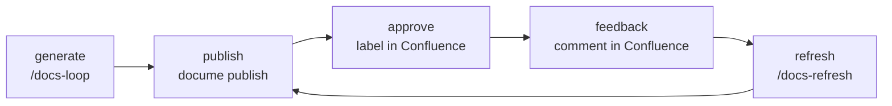

<div align="center">


# DocuMe

**Your documentation lives in the repository. Confluence is the read surface.**


[Quickstart](#quickstart) · [Lifecycle](#the-lifecycle-after-the-first-publish) · [Commands](#commands) · [Skills](#skills) · [Docs pages](docs/index.html) · [Changelog](CHANGELOG.md)

</div>

---

A docs-lifecycle toolkit for repo-based wikis published to Confluence Cloud. Markdown lives in your
repository. DocuMe publishes it, records which pages a human approved, invalidates that approval when the
content changes, brings reviewers' Confluence comments back as pull requests, and tells you which pages
went stale when the code they describe moved.



> [!IMPORTANT]
> **The repo is the source of truth.** Hand edits made in Confluence are overwritten on the next publish.
> That is the design, not a limitation: everything that reaches a page went through a pull request first.

## Two tiers

| Tier | What it is | What it may do |
|---|---|---|
| `docume` | A .NET 10 CLI, distributed as a `dotnet tool` | Deterministic. The only thing that talks to the Confluence API. |
| DocuMe plugin | Claude Code skills | Judgement: writing a page, deciding whether a reviewer is right, rewriting a page whose code moved. **Output is always a pull request.** Never touches Confluence. |

Repo-specific knowledge (your domain list, tone, audience, page structure) does not live in either tier. It
lives in your repo, in `docume.json` and `docs/wiki/_meta/STYLE.md`, which every skill reads at start.

---

## Quickstart

Seven steps, in order. Steps 0–4 are setup you do once; 5–7 are the loop you run from then on.

### 0. Prerequisites

- **.NET SDK 10.0.100** or later (`dotnet --version`).
- **Node 20+**, only if your pages contain mermaid diagrams, plus the renderer's one dependency in the
  repo root: `npm install beautiful-mermaid@1.1.3`. `docume status` warns when Node or the render script is
  missing; the package itself is only discovered at render time, and the renderer exits with a distinct code
  telling you to install it.
- A **Confluence Cloud space you are willing to have overwritten**, and an API token from
  [id.atlassian.com/manage-profile/security/api-tokens](https://id.atlassian.com/manage-profile/security/api-tokens).
  Start with a fresh empty space, not one holding hand-written pages: `publish` overwrites and
  `publish --prune` deletes.
- **Claude Code**, for the plugin half. The CLI half works without it.

### 1. Install the CLI

Packages go to **GitHub Packages**, which authenticates every read, including public ones. So the feed needs
a personal access token with `read:packages` before the install line works:

```bash
dotnet nuget add source https://nuget.pkg.github.com/moberghr/index.json \
  --name moberg-github \
  --username <your-github-username> \
  --password <a PAT with read:packages> \
  --store-password-in-clear-text

dotnet tool install --global DocuMe.Cli
docume --version
```

> [!WARNING]
> **A token is not the whole of it.** The feed authenticates, and the package is also *scoped to this
> repository*: a `GITHUB_TOKEN` minted for your repo is refused with `403` no matter what scopes it holds,
> and being in the same organisation does not change that. For CI, either grant your repo read on the
> package (Packages → DocuMe.Cli → Manage Actions access, and again for DocuMe.Core) or give it a
> `DOCUME_PACKAGES_TOKEN` secret. The scaffolded workflows also need `packages: read`, which they now
> declare — v0.1.0's did not, and every docs job in a consumer repo failed on that 403.

Per-repository pinning is the other half of this and it is what `init` scaffolds in step 3: a
`.config/dotnet-tools.json` naming the exact version, restored with `dotnet tool restore`. That is how the
workflows get the CLI, and it is why two repos can sit on different DocuMe versions.

The feed has to be added on the runner too, for the same reason it has to be added here, and the
scaffolded workflows do it themselves — they read a `DOCUME_PACKAGES_TOKEN` secret and fall back to the
job's own `GITHUB_TOKEN`, which works only once the package grants that repository read. See step 4.

### 2. Install the Claude Code plugin

The repository is its own marketplace, so it installs directly:

```
/plugin marketplace add moberghr/docu-me
/plugin install docume@docume
```

`docu-me` is private, so this clone uses your git credentials.

### 3. Scaffold your repo

From the root of the repository you want documented:

```bash
docume init --space DOCS --base-url https://your-domain.atlassian.net/wiki
```

Thirteen targets, and it is idempotent: a file DocuMe owns is never overwritten, and the two files it
shares with you (`.gitignore`, `.config/dotnet-tools.json`) are merged rather than replaced. Re-running
reports skips.

| Target | What it is |
|---|---|
| `docume.json` | Config: space, base URL, wiki root, label names, mermaid renderer path |
| `docs/wiki/README.md` | The wiki's root page |
| `docs/wiki/_meta/STYLE.md` | Your authoring conventions. **Fill this in** — it is what the skills read |
| `docs/wiki/_meta/state.json` | Machine-owned: page ids, versions, content hashes, approvals. Committed |
| `.github/workflows/docs-drift-pr.yml` | Comments on a PR that touches code a page derives from |
| `.github/workflows/docs-drift.yml` | Marks pages stale after a deploy |
| `.github/workflows/docs-feedback.yml` | Turns a triaged reviewer comment into a fix PR |
| `.github/workflows/docs-publish.yml` | Publishes on merge to the default branch |
| `.github/workflows/docs-refresh.yml` | Nightly: regenerates pages whose sources moved |
| `.github/workflows/docs-sync.yml` | Every 6h: pulls labels and comments back into the repo |
| `.config/dotnet-tools.json` | Pins the `docume` version this repo uses |
| `tools/render-mermaid.mjs` | Renders mermaid blocks to SVG attachments |
| `.gitignore` | One entry, `node_modules/`, for the render script's dependencies |

Nothing else DocuMe writes is ignored: the state file and the feedback inbox are meant to be committed, and
every scratch file the workflows make goes to `$RUNNER_TEMP`.

### 4. Set credentials

Locally, as environment variables:

```bash
export DOCUME_CONFLUENCE_EMAIL="you@example.com"
export DOCUME_CONFLUENCE_TOKEN="<your Atlassian API token>"
```

For the workflows, as repository secrets: `DOCUME_CONFLUENCE_EMAIL`, `DOCUME_CONFLUENCE_TOKEN`, and
`ANTHROPIC_API_KEY` for the two that call a skill (`docs-feedback`, `docs-refresh`).

One more, and only from outside Moberg: `DOCUME_PACKAGES_TOKEN`, a PAT with `read:packages`. Every
scaffolded workflow adds the GitHub Packages feed before restoring the pinned CLI, and it falls back to
the job's own `GITHUB_TOKEN` — which can read the package from a repository in the same organisation and
cannot from another one. Without a feed the restore fails on the first docs job with NuGet's own wording,
which never mentions DocuMe.

> [!WARNING]
> **Never put either credential in `docume.json`.** That file is committed. DocuMe reads credentials from
> the environment and from nowhere else.

### 5. Write pages

A page is a markdown file under `docs/wiki/`. The directory tree becomes the Confluence page tree, and a
numeric prefix (`10-domains/`) expresses ordering intent that publish reconciles in Confluence.

Frontmatter is stripped before upload:

```markdown
---
sources:
  - src/Loans/**
  - src/AppApi/Services/LoanService.cs
title: Loans Domain     # optional; defaults to the first H1
---

# Loans Domain

...
```

`sources` is the load-bearing field. It is what `drift` matches changed files against, what marks a page
stale, and what `/docs-refresh` regenerates from. A page with no `sources` is never reported as drifted.

**To generate the pages instead of writing them, run `/docs-loop` in Claude Code.** Fill in
`docs/wiki/_meta/STYLE.md` first — its four bullets (audience, tone, structure, verification) are what the
skill reads instead of carrying assumptions about your repo. The first run builds an inventory of what the
wiki should cover, into `docs/wiki/_meta/PROGRESS.md`, and writes no page: correct that list before forty
pages get generated against it. Each run after that takes one unit, reads its code, writes the page with its
`sources` and a citation behind every claim, and adds a commit to a `docs/loop-<date>` pull request.

### 6. Check before you publish

```bash
docume convert docs/wiki      # converts every page, reports failures and degradations; writes nothing
docume publish --dry-run      # the full plan: created / updated / skipped / orphaned
docume status                 # config, token, space, node, and repo-vs-published drift
```

`convert` is the one to run first. The converter fails loud on a construct it cannot represent rather than
publishing a page that silently lost a section.

### 7. Publish

```bash
docume publish
```

Parents before children, attachments hashed and uploaded only when changed, an approval banner injected
above each body, and a child-order pass that makes Confluence match your tree. Pages whose content hash is
unchanged are skipped.

---

## The lifecycle after the first publish

| Step | How it happens |
|---|---|
| **Approve** | A reviewer adds the `approved` label to a page in Confluence. `docume sync --labels` records it into `state.json`. |
| **Invalidate** | Republishing a page whose content changed removes the label and moves the page's state to `needs-review` — a `state.json` status, not a label. The injected banner is excluded from the content hash, so machine edits never cost an approval. |
| **Feedback** | A reviewer comments on a page. `docume sync --comments` writes it into `docs/wiki/_meta/feedback/inbox/`. `/docs-feedback` verifies the claim against the code and opens a `docs/feedback-<date>` PR, or declines it with a citation. `docume sync --reply` answers the comment once the fix is published. |
| **Drift** | `docume drift` matches changed files against every page's `sources`. On a PR it comments; after a deploy, `--mark` adds the `stale` label. Labels only, never page-body edits: staleness must not bump a page version or disturb an approval. |
| **Refresh** | `/docs-refresh` rewrites the stale pages and opens `docs/refresh-<date>`. |
| **Report** | `docume dashboard` regenerates a "Documentation Status" page in Confluence; `docume status` prints the same data in your terminal. |

> [!CAUTION]
> Every skill reads a Confluence comment as a **claim to verify against the code**, never as an instruction
> to follow. A comment body is untrusted input, and nothing a reviewer wrote is echoed into a page body.

## Commands

| Command | What it does |
|---|---|
| `docume init` | Scaffold a consumer repo. `--adopt` builds state from a wiki you already have. |
| `docume convert` | Convert every page, report failures and degradations. Read-only. |
| `docume publish` | Convert and publish. `--dry-run`, `--changed-since`, `--page`, `--force`, `--prune`. |
| `docume sync` | Read labels and comments out of Confluence into `state.json` and the inbox. `--reply` posts answers. |
| `docume drift` | Which pages derive from code that changed. `--mark` labels them stale. |
| `docume dashboard` | Regenerate the Documentation Status page. |
| `docume status` | What is published, what drifted, whether this repo can publish. `--json` for a PR body. |

`--help` on any of them is the current truth. Every command exits non-zero on failure, and a 401 or 403 from
Confluence is a hard stop with a token-expiry message rather than a retry.

Three of the seven can write to Confluence — `publish`, `dashboard`, and `sync --reply` — and `drift --mark`
writes labels. Everything else is read-only.

## Skills

| Skill | What it does |
|---|---|
| `/docs-loop` | Writes the pages. One unit per run, read from the code, every claim cited; opens `docs/loop-<date>`. |
| `/docs-refresh` | Rewrites the pages whose `sources` changed since the baseline; opens `docs/refresh-<date>`. |
| `/docs-feedback` | Verifies a reviewer's comment against the code; opens `docs/feedback-<date>` or declines with a citation. |

All three end by putting `docume status --json` in the PR body, so the state of the wiki is visible in the
pull request a reviewer is already reading. All three also have the other ending, the one a nightly job has
most nights: they stop without a branch, a commit or a pull request. An empty PR costs a reviewer more than
it tells them.

## Documentation

| Where | What is in it |
|---|---|
| [`docs/index.html`](docs/index.html) | The overview page: the problem, the lifecycle, the two tiers, the install story |
| [`docs/how-it-works.html`](docs/how-it-works.html) | Every command with its options, the config surface, the conversion contract, the workflows |
| [`docs/wiki/`](docs/wiki/README.md) | DocuMe's own wiki, generated and published by DocuMe |
| [`CHANGELOG.md`](CHANGELOG.md) | What changed, per release |
| [`PLAN.md`](PLAN.md) | The build spec, milestone by milestone |
| [`plugin/README.md`](plugin/README.md) | The plugin's own conventions |

The two HTML pages are self-contained and open straight from disk; they are also what GitHub Pages would
serve from `docs/`.

## Working on DocuMe itself

```bash
dotnet build DocuMe.slnx -c Release
dotnet test --solution DocuMe.slnx -c Release
```

xUnit v3 on the Microsoft Testing Platform, so `dotnet test` takes the solution via `--solution` rather than
positionally. Central Package Management, and the four house analyzer packs run as errors: a build with a
warning is a build that fails.

To run the CLI without installing it:

```bash
dotnet run --project src/DocuMe.Cli -- --help
```

Five commands read `docume.json` from the working directory — `publish`, `sync`, `drift`, `dashboard`,
`status` — so point those at a consumer repo with `--config <path>` rather than running them against this
one. The other two take no `--config`: `init` writes the file, and `convert` takes the wiki root as an
argument (`docume convert docs/wiki`).

**Releasing.** One tag releases everything. Three files carry the version and all three are bumped in one
commit before the tag: `Directory.Build.props`, `plugin/.claude-plugin/plugin.json`, and the git-subdir
`ref` in `plugin/README.md`. Then `git tag vX.Y.Z && git push origin vX.Y.Z`. The release workflow's first
step refuses the release if any of the three disagrees with the tag, and the release notes carry the
marketplace entry with `ref` already filled in.

---

<div align="center">

**Moberg** — Serious engineering, infinite possibilities · Reykjavík + Zagreb

</div>
