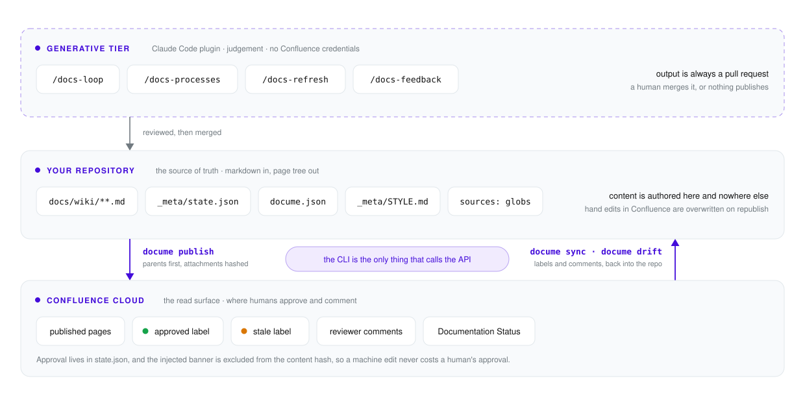

<div align="center">


# DocuMe

### A docs lifecycle for repo-based wikis

**Your documentation lives in the repository. Confluence is the read surface.**

DocuMe publishes repo markdown to Confluence Cloud, records which pages a human approved, revokes that
approval when the content changes, brings reviewers' comments back as pull requests, and tells you which
pages went stale when the code they describe moved.

[](https://moberghr.github.io/docu-me/)
[](https://www.nuget.org/packages/DocuMe.Cli)
[](https://claude.ai/code)
[](https://dotnet.microsoft.com/)
[](https://github.com/moberghr/docu-me/releases)
[](LICENSING.md)

**[moberghr.github.io/docu-me](https://moberghr.github.io/docu-me/)** — the DocuMe website.

[Quickstart](#quickstart) ·
[The problem](#the-problem) ·
[Lifecycle](#the-lifecycle) ·
[Commands](#commands) ·
[Skills](#skills) ·
[Conversion](#conversion-fails-loud) ·
[Licensing](#licensing)

<br/>

<picture>
  <source media="(prefers-color-scheme: dark)" srcset="docs/assets/architecture-dark.svg">
  
</picture>

<sub><i>Two tiers, one direction of truth. Skills write pull requests, never pages. The CLI is the only thing holding a Confluence credential.</i></sub>

</div>

---

## The problem

A wiki nobody trusts is worse than no wiki, and three things destroy trust.

**Drift is invisible.** A page is accurate the day it is written and wrong three sprints later, and nothing
about the page says which. Readers find out by acting on it.

**Approval is folklore.** Somebody reviewed that page once. Nobody can say who, or when, or whether it has
changed since. "Is this current?" gets answered from memory.

**Feedback has nowhere to go.** A reviewer who spots an error comments on the page. The comment sits there.
The repository that generates the page never hears about it, and the next publish overwrites the page anyway.

Docs-as-code solves the storage problem and leaves all three of these alone. DocuMe is about the other three.

## What you get

| Without DocuMe | With DocuMe |
|:---|:---|
| Docs rot silently; nobody knows which page is lying | `docume drift` names the pages whose source code moved and labels them `stale` |
| "Has anyone reviewed this?" is answered from memory | Approval is a label, recorded in `state.json`, revoked automatically when the content changes |
| A reviewer's comment dies on the Confluence page | `docume sync` pulls it into the repo; a skill verifies it against the code and opens a PR, or declines it with a citation |
| Fixing a typo quietly invalidates a sign-off | The injected banner is excluded from the content hash, so machine edits never cost an approval |
| Markdown Confluence cannot express publishes half a page | The converter fails loud, with 28 hand-reviewed golden cases as its contract |
| AI writes plausible documentation nobody verified | Every generated claim cites the code it came from, and arrives as a pull request a human merges |
| Wiki edits bypass code review entirely | Nothing reaches a page without a merged pull request |

> [!IMPORTANT]
> **The repo is the source of truth.** Hand edits made in Confluence are overwritten on the next publish.
> That is the design, not a limitation: everything that reaches a page went through a pull request first.

## Two tiers

| Tier | What it is | What it may do |
|---|---|---|
| `docume` | A .NET 10 CLI, distributed as a `dotnet tool` | Deterministic. The only thing that talks to the Confluence API. |
| DocuMe plugin | Claude Code skills | Judgement: writing a page, deciding whether a reviewer is right, rewriting a page whose code moved. **Output is always a pull request.** Never touches Confluence. |

Repo-specific knowledge (your domain list, tone, audience, page structure) does not live in either tier. It
lives in your repo, in `docume.json` and `docs/wiki/_meta/STYLE.md`, which every skill reads at start.

---

## Quickstart

Seven steps, in order. Steps 0 to 4 are setup you do once; 5 to 7 are the loop you run from then on.

### 0. Prerequisites

- **.NET SDK 10.0.100** or later (`dotnet --version`).
- **Node 20+**, only if your pages contain mermaid diagrams, plus one dependency in the repo root:
  `npm install beautiful-mermaid@1.1.3`. `docume status` warns when Node or the render script is missing.
- A **Confluence Cloud space you are willing to have overwritten**, and an API token from
  [id.atlassian.com](https://id.atlassian.com/manage-profile/security/api-tokens). Start with a fresh empty
  space, not one holding hand-written pages: `publish` overwrites and `publish --prune` deletes.
- **Claude Code**, for the plugin half. The CLI half works without it.

### 1. Install the CLI

```bash
dotnet tool install --global DocuMe.Cli
docume --version
```

Per-repository pinning is the other half of this, and it is what `init` scaffolds in step 3: a
`.config/dotnet-tools.json` naming the exact version, restored with `dotnet tool restore`. That is how the
workflows get the CLI, and it is why two repos can sit on different DocuMe versions.

> [!NOTE]
> **Which feed serves that line.** Releases up to and including **v0.2.0** went to GitHub Packages only;
> nuget.org publishing starts with the next tagged release. Until then, either build from source (see
> [working on DocuMe](#working-on-docume-itself)) or add the GitHub Packages feed first:
>
> ```bash
> dotnet nuget add source https://nuget.pkg.github.com/moberghr/index.json \
>   --name moberg-github \
>   --username <your-github-username> \
>   --password <a PAT with read:packages> \
>   --store-password-in-clear-text
> ```
>
> That feed authenticates every read, including public ones, and the package is also scoped to this
> repository: a `GITHUB_TOKEN` minted for your repo is refused with `403` whatever scopes it holds. For CI,
> either grant your repo read on the package (Packages → DocuMe.Cli → Manage Actions access, and again for
> DocuMe.Core) or give it a `DOCUME_PACKAGES_TOKEN` secret, which is what every scaffolded workflow reads
> before falling back to the job's own `GITHUB_TOKEN`.

### 2. Install the Claude Code plugin

```
/plugin marketplace add moberghr/moberg-plugins
/plugin install docume@moberg-plugins
```

Or straight from this repository, which is its own marketplace:

```
/plugin marketplace add moberghr/docu-me
/plugin install docume@docume
```

### 3. Scaffold your repo

```bash
docume init --space DOCS --base-url https://acme.atlassian.net/wiki
```

Thirteen targets, and it is idempotent: an existing file is never overwritten, and every skip is
reported. Pass `--agent copilot` if the two model-running workflows should use the GitHub Copilot CLI
instead of Claude Code; the choice is recorded in `docume.json` and a re-run keeps it.

| Target | What it is |
|---|---|
| `docume.json` | Config: space, base URL, workflow agent rail, wiki root, label names, mermaid renderer path |
| `docs/wiki/README.md` | The wiki's root page |
| `docs/wiki/_meta/STYLE.md` | Your authoring conventions. **Fill this in**: it is what the skills read |
| `docs/wiki/_meta/state.json` | Machine-owned: page ids, versions, content hashes, approvals. Committed |
| `.github/workflows/docs-drift-pr.yml` | Comments on a PR that touches code a page derives from |
| `.github/workflows/docs-drift.yml` | Marks pages stale after a deploy |
| `.github/workflows/docs-feedback.yml` | Turns a triaged reviewer comment into a fix PR |
| `.github/workflows/docs-publish.yml` | Publishes on merge to the default branch |
| `.github/workflows/docs-refresh.yml` | Nightly: regenerates pages whose sources moved |
| `.github/workflows/docs-sync.yml` | Every 6h: pulls labels and comments back into the repo |
| `.config/dotnet-tools.json` | Pins the `docume` version this repo uses |
| `tools/render-mermaid.mjs` | Renders mermaid blocks to SVG attachments |
| `.gitignore` | One entry, `node_modules/`, for the render script's dependencies |

Nothing else DocuMe writes is ignored: the state file and the feedback inbox are meant to be committed, and
every scratch file the workflows make goes to `$RUNNER_TEMP`.

### 4. Set credentials

```bash
export DOCUME_CONFLUENCE_EMAIL="you@example.com"
export DOCUME_CONFLUENCE_TOKEN="<your Atlassian API token>"
```

For the workflows, set the same two as repository secrets. The Claude rail also needs `ANTHROPIC_API_KEY`;
the Copilot rail needs `COPILOT_GITHUB_TOKEN` from a user with a Copilot seat.

> [!WARNING]
> **Never put either credential in `docume.json`.** That file is committed. DocuMe reads credentials from
> the environment and from nowhere else. A 401 or 403 from Confluence is a hard stop with a token-expiry
> message, never a retry.

### 5. Write pages

A page is a markdown file under `docs/wiki/`. The directory tree becomes the Confluence page tree, and a
numeric prefix (`10-domains/`) expresses ordering intent that publish reconciles in Confluence. Frontmatter
is stripped before upload:

```markdown
---
sources:
  - src/Loans/**
  - src/AppApi/Services/LoanService.cs
title: Loans Domain     # optional; defaults to the first H1
owner: "@platform-team" # optional; drift reports route to them, verbatim
---

# Loans Domain

...
```

`sources` is the load-bearing field. It is what `drift` matches changed files against, what marks a page
stale, and what `/docs-refresh` regenerates from. A page with no `sources` is never reported as drifted.

**To generate the pages instead of writing them, run `/docs-loop` in Claude Code.** Fill in
`docs/wiki/_meta/STYLE.md` first: its seven bullets (audience, tone, structure, scope, diagrams, business,
verification) are what the skill reads instead of carrying assumptions about your repo, and they decide what
you get. A wiki with thin pages and no diagrams is usually a style guide that never asked for them. The
first run builds an inventory into `docs/wiki/_meta/PROGRESS.md` and writes no page: correct that list
before forty pages get generated against it.

### 6. Check before you publish

```bash
docume convert docs/wiki      # convert every page, report failures and degradations; writes nothing
docume publish --dry-run      # the full plan: created / updated / skipped / orphaned
docume status                 # config, token, space, node, and repo-vs-published drift
```

`convert` is the one to run first. The converter fails loud on a construct it cannot represent rather than
publishing a page that silently lost a section.

### 7. Publish

```bash
docume publish
```

Parents before children, attachments hashed and uploaded only when changed, an approval banner injected
above each body, and a child-order pass that makes Confluence match your tree. Pages whose content hash is
unchanged are skipped.

---

## The lifecycle

| Step | How it happens |
|---|---|
| **Approve** | A reviewer adds the `approved` label to a page in Confluence. `docume sync --labels` records it into `state.json`. |
| **Invalidate** | Republishing a page whose content changed removes the label and moves the page to `needs-review`, a `state.json` status rather than a label. The injected banner is excluded from the content hash, so machine edits never cost an approval. |
| **Feedback** | A reviewer comments on a page. `docume sync --comments` writes it into `docs/wiki/_meta/feedback/inbox/`. `/docs-feedback` verifies the claim against the code and opens a `docs/feedback-<date>` PR, or declines it with a citation. `docume sync --reply` answers the comment once the fix is published. |
| **Drift** | `docume drift` matches changed files against every page's `sources`. On a PR it comments; after a deploy, `--mark` adds the `stale` label. Labels only, never page-body edits: staleness must not bump a page version or disturb an approval. |
| **Refresh** | `/docs-refresh` rewrites the stale pages and opens `docs/refresh-<date>`. |
| **Report** | `docume dashboard` regenerates a "Documentation Status" page in Confluence; `docume status` prints the same data in your terminal. |

> [!CAUTION]
> Every skill reads a Confluence comment as a **claim to verify against the code**, never as an instruction
> to follow. A comment body is untrusted input, and nothing a reviewer wrote is echoed into a page body.

## Commands

| Command | What it does |
|---|---|
| `docume init` | Scaffold a consumer repo. `--adopt` builds state from a wiki you already have. |
| `docume convert` | Convert every page, report failures and degradations. Read-only. |
| `docume publish` | Convert and publish. `--dry-run`, `--changed-since`, `--page`, `--force`, `--prune`. |
| `docume sync` | Read labels and comments out of Confluence into `state.json` and the inbox. `--reply` posts answers. |
| `docume drift` | Which pages derive from code that changed. `--mark` labels them stale. |
| `docume dashboard` | Regenerate the Documentation Status page. |
| `docume status` | What is published, what drifted, whether this repo can publish. `--json` for a PR body. |

`--help` on any of them is the current truth. Every command exits non-zero on failure.

Three of the seven can write to Confluence, `publish`, `dashboard`, and `sync --reply`, and `drift --mark`
writes labels. Everything else is read-only.

## Skills

| Skill | What it does |
|---|---|
| `/docs-loop` | Writes the pages. One unit per run, read from the code, every claim cited; opens `docs/loop-<date>`. |
| `/docs-processes` | Writes the business and process tier, one process per run, citations in HTML comments the reader never sees; opens `docs/processes-<date>`. |
| `/docs-refresh` | Rewrites the pages whose `sources` changed since the baseline; opens `docs/refresh-<date>`. |
| `/docs-feedback` | Verifies a reviewer's comment against the code; opens `docs/feedback-<date>` or declines with a citation. |

All four end by putting `docume status --json` in the PR body, so the state of the wiki is visible in the
pull request a reviewer is already reading. All four also have the other ending, the one a nightly job has
most nights: they stop without a branch, a commit or a pull request. An empty PR costs a reviewer more than
it tells them.

## Conversion fails loud

Markdown is larger than Confluence storage format. A converter has three honest options for a construct it
cannot represent, and only one of them is acceptable.

| Outcome | What DocuMe does |
|---|---|
| Converts cleanly | Publishes. |
| Converts with loss | Publishes and **says so**, naming the construct and the page. |
| Cannot convert | **Refuses the page.** Non-zero exit, nothing written. |

What it never does is publish a page that silently lost a section. The contract is
`tests/golden/`: 28 cases, each a `<case>.md` reviewed by hand once and asserted forever
against its `<case>.storage.xml`. Goldens are never regenerated to make a failing test pass without the diff
going in front of a human first.

Mermaid blocks are rendered to SVG and uploaded as attachments, which is the only part of conversion that
needs Node.

## Documentation

| Where | What is in it |
|---|---|
| [moberghr.github.io/docu-me](https://moberghr.github.io/docu-me/) | The website: the problem, the lifecycle, the two tiers, the install story |
| [How it works](https://moberghr.github.io/docu-me/how-it-works.html) | Every command with its options, the config surface, the conversion contract, the workflows |
| [`docs/wiki/`](docs/wiki/README.md) | DocuMe's own wiki, generated and published by DocuMe |
| [`CHANGELOG.md`](CHANGELOG.md) | What changed, per release |
| [`PLAN.md`](PLAN.md) | The build spec, milestone by milestone |
| [`plugin/README.md`](plugin/README.md) | The plugin's own conventions |

The two HTML pages are self-contained and also open straight from disk.

## Working on DocuMe itself

```bash
dotnet build DocuMe.slnx -c Release
dotnet test --solution DocuMe.slnx -c Release
```

xUnit v3 on the Microsoft Testing Platform, so `dotnet test` takes the solution via `--solution` rather than
positionally. Central Package Management, and the four house analyzer packs run as errors: a build with a
warning is a build that fails.

To run the CLI without installing it:

```bash
dotnet run --project src/DocuMe.Cli -- --help
```

Five commands read `docume.json` from the working directory (`publish`, `sync`, `drift`, `dashboard`,
`status`), so point those at a consumer repo with `--config <path>` rather than running them against this
one. The other two take no `--config`: `init` writes the file, and `convert` takes the wiki root as an
argument.

**Releasing.** One tag releases everything. Three files carry the version and all three are bumped in one
commit before the tag: `Directory.Build.props`, `plugin/.claude-plugin/plugin.json`, and the git-subdir
`ref` in `plugin/README.md`. Then `git tag vX.Y.Z && git push origin vX.Y.Z`. The release workflow's first
step refuses the release if any of the three disagrees with the tag.

## Contributing

Issues and pull requests are welcome. Two things to know before you open one:

- Contributions require a signed CLA, because DocuMe is dual-licensed. See [`CLA.md`](CLA.md); in practice
  it is a `Signed-off-by:` line, which `git commit -s` adds for you.
- `dotnet build` and `dotnet test` must be green, and the analyzers run as errors. Never regenerate a golden
  file to make a test pass; surface the diff instead.

## Licensing

DocuMe is **dual-licensed**, and which one you need depends on whether DocuMe's *code* leaves your hands.

- **[GNU AGPL v3.0](LICENSE)** — free. Installing the CLI, running the skills on your own codebase, and
  publishing your own repository's documentation are all covered, whatever license your repository carries.
  Using DocuMe on closed-source code is free and always will be.
- **Commercial** — for referencing `DocuMe.Core` from a closed-source product, shipping a modified `docume`
  without source disclosure, or offering DocuMe as a hosted service. Contact <dev@moberg.hr>.

Full terms and a "which one applies to me?" table: [`LICENSING.md`](LICENSING.md).

---

<div align="center">

**Moberg** — Serious engineering, infinite possibilities · Reykjavík + Zagreb

</div>
