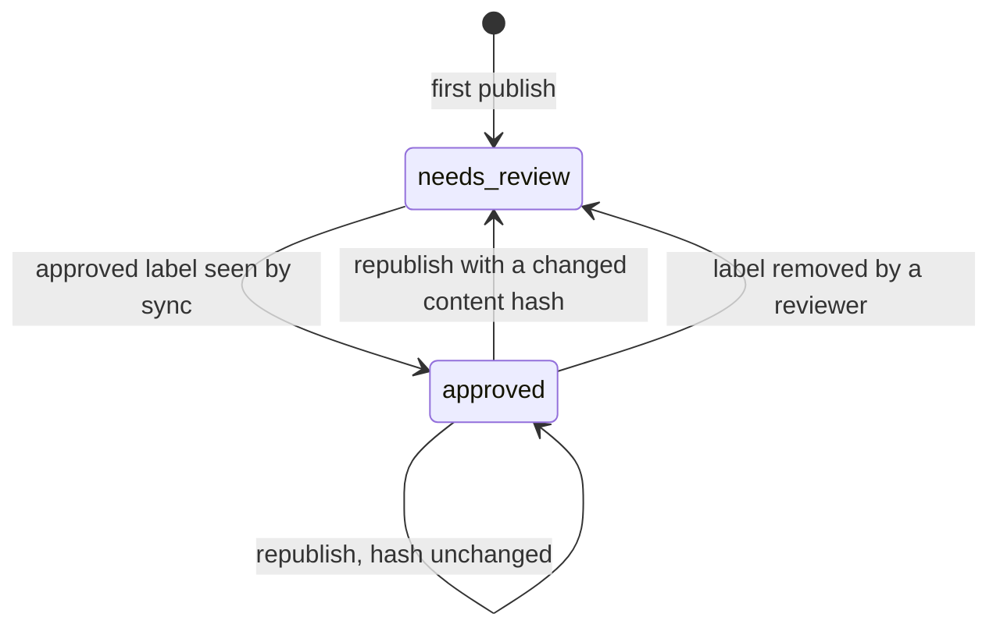

---
sources:
  - src/DocuMe.Core/State/*.cs
  - src/DocuMe.Core/Sync/*.cs
  - src/DocuMe.Core/Drift/*.cs
  - src/DocuMe.Core/Dashboard/*.cs
  - src/DocuMe.Core/Publishing/PublishPipeline.cs
  - src/DocuMe.Core/Publishing/PrunePlan.cs
  - src/DocuMe.Core/Markdown/PageBanner.cs
  - src/DocuMe.Core/Markdown/MermaidAttachmentName.cs
---

# Approval and Drift

Two independent questions about a page, tracked two different ways.

- **Approval** — has a human read this page and accepted it? Answered by a label, invalidated by a
  content change.
- **Drift** — has the code this page describes moved since the page was written? Answered by a diff
  against the page's `sources` globs.

A page can be approved and drifted at the same time. That combination is exactly the one worth
finding: somebody signed off on a description that is no longer true.

The approval half is a state machine, and staleness deliberately appears nowhere in it — a stale
label never moves an approval:



## How approval is recorded

A reviewer adds the `approved` label in Confluence. `docume sync --labels` reads it and writes an
approval entry into `_meta/state.json`, carrying the page version it was approved at. The entry
holds no content hash: the hash lives on the page entry beside it and always describes the *last
publish*, so invalidation is decided when a publish computes a new hash, not by comparing against a
hash the approval remembered.

| Field | Meaning |
|---|---|
| `status` | `approved` or `needs-review` |
| `approvedBy` | Always `unknown` — see the note below |
| `approvedAt` | When a sync run saw the label at `approvedVersion`. Restamped if the page reaches a new version with the label still on, and the stamp it displaces goes to `history` |
| `approvedVersion` | The Confluence page version the approval applies to |
| `history` | Every prior approval. One is archived when an approval is invalidated, and also when a still-valid approval is re-recorded at a newer version |

> [!NOTE]
> `approvedBy` reads `unknown` by design. Confluence Cloud exposes no label author anywhere the API
> can reach it — not on CQL search results, not on the v1 or v2 label endpoints. Filling the field
> with the account DocuMe authenticates as would put a fabricated approver into an audit trail, so it
> stays honest instead. The label itself is the gesture that counts.

## What invalidates an approval

Two things, and they run through the same transition.

**A republish whose content hash changed.** The hash is taken over the converted body before the
banner is injected, which is what keeps machine noise out of it:

- Editing one sentence of the markdown invalidates.
- A new publish date in the banner does not.
- A dashboard refresh does not.
- Reparenting a page does not: where a page hangs is not what a reviewer approved.
- `--force` does not on its own. It re-uploads everything, but an unchanged hash means unchanged
  content, and §8 invalidates on content change only.

When it happens, DocuMe removes the `approved` label from the page, moves the approval into `history`
and sets `status` to `needs-review`. Nothing is lost, and nobody has to notice manually.

Attachment bytes sit outside the hash entirely, and that has one consequence worth stating plainly:
a hand-placed image whose bytes change is **re-uploaded with the approval left standing**, because
the body still says the same thing. It is the one case where an approved page visibly changes
without a re-review. A mermaid diagram is not that case — its attachment filename is derived from
the diagram source, so editing a diagram changes the body and invalidates like any other edit.

**A reviewer taking the label off.** `docume sync --labels` reads "label absent, state says approved"
as a revocation and applies the identical transition: the approval is archived to `history` and
`status` becomes `needs-review`. There is no label for DocuMe to remove here — the reviewer already
removed it.

## How drift is found

Each page declares the code it derives from, in frontmatter:

```yaml
---
sources:
  - src/DocuMe.Core/Publishing/*.cs
  - src/DocuMe.Core/State/StateStore.cs
---
```

`docume drift` diffs two revisions and reports every page whose globs match a changed file, with the
matching pattern and files named so a reader can judge the report rather than trust it. The baseline
defaults to `state.baselineSha`, the commit the wiki content was last *generated* against — not the
commit it was last published from. Those differ, and using the publish sha would hide drift that a
publish-only run introduced.

A page with no `sources` is counted and skipped. A wiki where *no* page declares sources reports
`sourcesUndeclared`, which reads as "drift detection is not configured here" rather than "nothing
drifted".

## Marking pages stale

`docume drift --mark` adds the `stale` label to every affected page, sets `stale: true` in state, and
refreshes the dashboard.

> [!CAUTION]
> Staleness is a label and a dashboard row, never a page-body edit. Editing bodies to add a
> "this may be out of date" banner would bump the page version, churn the content hash, and revoke
> every approval in the space on the first nightly run.

## The dashboard

`docume dashboard` publishes one page — `Documentation Status` by default — listing every page with
its approval state, staleness and last publish. It is generated from state plus the live labels, and
it is deliberately **not** tracked in state itself: a page DocuMe publishes but does not own would
otherwise look like an orphan to `publish --prune` and be deleted.
