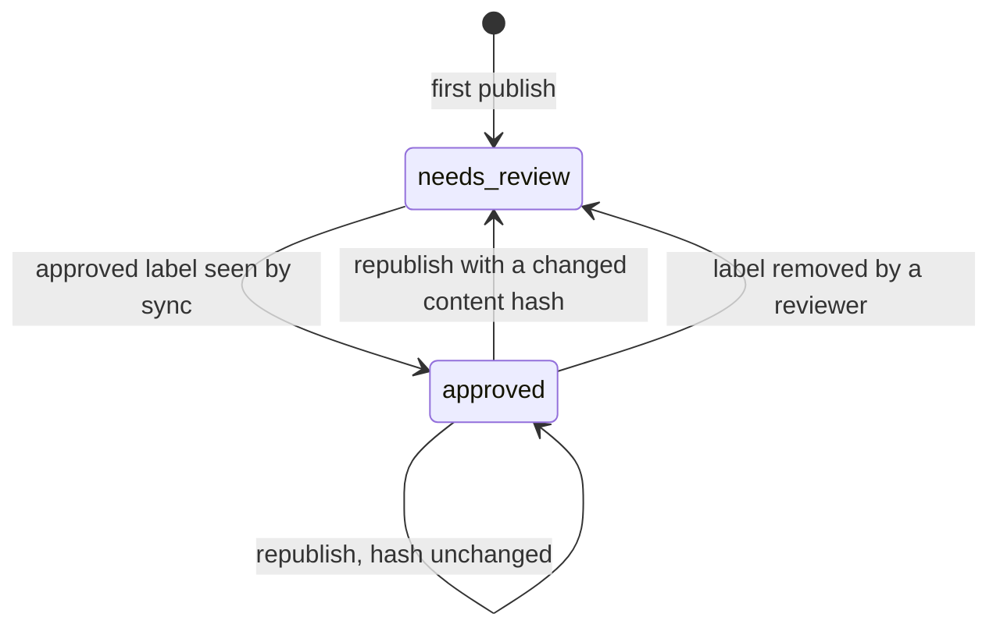

---
sources:
  - src/DocuMe.Core/State/*.cs
  - src/DocuMe.Core/Sync/*.cs
  - src/DocuMe.Core/Drift/*.cs
  - src/DocuMe.Core/Dashboard/*.cs
  - src/DocuMe.Core/Publishing/PublishPipeline.cs
  - src/DocuMe.Core/Publishing/PrunePlan.cs
  - src/DocuMe.Core/Markdown/PageBanner.cs
  - src/DocuMe.Core/Markdown/MermaidAttachmentName.cs
---

# Approval and Drift

Two independent questions about a page, tracked two different ways.

- **Approval** — has a human read this page and accepted it? Answered by a label, invalidated by a
  content change.
- **Drift** — has the code this page describes moved since the page was written? Answered by a diff
  against the page's `sources` globs.

A page can be approved and drifted at the same time. That combination is exactly the one worth
finding: somebody signed off on a description that is no longer true.

The approval half is a state machine, and staleness deliberately appears nowhere in it — a stale
label never moves an approval:



## How approval is recorded

A reviewer adds the `approved` label in Confluence. `docume sync --labels` reads it and writes an
approval entry into `_meta/state.json`, carrying the page version it was approved at. The entry
holds no content hash: the hash lives on the page entry beside it and always describes the *last
publish*, so invalidation is decided when a publish computes a new hash, not by comparing against a
hash the approval remembered.

| Field | Meaning |
|---|---|
| `status` | `approved` or `needs-review` |
| `approvedBy` | Always `unknown` — see the note below |
| `approvedAt` | When a sync run saw the label at `approvedVersion`. Restamped if the page reaches a new version with the label still on, and the stamp it displaces goes to `history` |
| `approvedVersion` | The Confluence page version the approval applies to |
| `history` | Every prior approval. One is archived when an approval is invalidated, and also when a still-valid approval is re-recorded at a newer version |

> [!NOTE]
> `approvedBy` reads `unknown` by design. Confluence Cloud exposes no label author anywhere the API
> can reach it — not on CQL search results, not on the v1 or v2 label endpoints. Filling the field
> with the account DocuMe authenticates as would put a fabricated approver into an audit trail, so it
> stays honest instead. The label itself is the gesture that counts.

## What invalidates an approval

Two things, and they run through the same transition.

**A republish whose content hash changed.** The hash is taken over the converted body before the
banner is injected, which is what keeps machine noise out of it:

- Editing one sentence of the markdown invalidates.
- A new publish date in the banner does not.
- A dashboard refresh does not.
- Reparenting a page does not: where a page hangs is not what a reviewer approved.
- `--force` does not on its own. It re-uploads everything, but an unchanged hash means unchanged
  content, and §8 invalidates on content change only.

When it happens, DocuMe removes the `approved` label from the page, moves the approval into `history`
and sets `status` to `needs-review`. Nothing is lost, and nobody has to notice manually.

Attachment bytes sit outside the hash entirely, and that has one consequence worth stating plainly:
a hand-placed image whose bytes change is **re-uploaded with the approval left standing**, because
the body still says the same thing. It is the one case where an approved page visibly changes
without a re-review. A mermaid diagram is not that case — its attachment filename is derived from
the diagram source, so editing a diagram changes the body and invalidates like any other edit.

**A reviewer taking the label off.** `docume sync --labels` reads "label absent, state says approved"
as a revocation and applies the identical transition: the approval is archived to `history` and
`status` becomes `needs-review`. There is no label for DocuMe to remove here — the reviewer already
removed it.

## How drift is found

Each page declares the code it derives from, in frontmatter:

```yaml
---
sources:
  - src/DocuMe.Core/Publishing/*.cs
  - src/DocuMe.Core/State/StateStore.cs
---
```

`docume drift` diffs two revisions and reports every page whose globs match a changed file, with the
matching pattern and files named so a reader can judge the report rather than trust it. The baseline
defaults to `state.baselineSha`, the commit the wiki content was last *generated* against — not the
commit it was last published from. Those differ, and using the publish sha would hide drift that a
publish-only run introduced.

A page with no `sources` is counted and skipped. A wiki where *no* page declares sources reports
`sourcesUndeclared`, which reads as "drift detection is not configured here" rather than "nothing
drifted".

## Sealed pages

A diff is evidence about commits, not about bytes. A file touched and reverted inside the range still
reads as changed, a merge that re-introduces identical bytes reads as changed, and one `baselineSha`
serving the whole wiki re-reports commits a page published this morning was already written from. All
three are phantom drift: a reviewer opens the page and nothing it describes has moved.

So publish leaves proof behind. A run that writes a page body also fingerprints every file that page's
`sources` globs match, taken over the files git tracks so gitignored build output is never in it, and
seals the hash into `_meta/state.json` as `verdict`, with the moment it was taken and the commit the run
was publishing. `docume drift` recomputes that fingerprint for the pages the diff flagged, and reports
every page whose sources are byte-identical to its seal as **sealed** rather than drifted.

Sealed pages are held out of every reader of the verdict at once. They are named in the table, carried in
the `sealed` array of `--format json` and in their own section of the PR comment, counted out of the exit
code under `--fail-on-drift`, and never labelled by `--mark`. The narrowing is always disclosed, with the
date of each seal beside the page: a machine deciding a page did not drift has to say which pages it
decided that about, and a seal is only as current as the publish behind it.

A page with no seal keeps the old behaviour exactly. Every page published before this existed, and every
page whose sources a publish could not read, answers drift from the commit range as it always did, and
the page's next publish seals it.

Four limits are worth stating rather than discovering:

- The seal is taken at publish, not at generation, and those are not the same moment. `/docs-loop` writes
  a page on Monday against `Rate.cs` as it stood then; `Rate.cs` changes on main on Tuesday; the docs PR
  merges and publishes on Wednesday, and the seal is the fingerprint of Wednesday's bytes — bytes the
  prose on the page never described. Drift then holds that page out, correctly by the seal's own claim
  and unhelpfully for the reader. The exposure is the age of a docs PR, and the honest summary is that
  the seal proves the sources have not moved *since publish*, not that the page was ever right.
- A publish from a dirty working tree seals uncommitted bytes. No fingerprint can detect that; `repoSha`
  is what makes it auditable afterwards.
- The fingerprint is over verbatim bytes, with no newline normalization, because a `sources` glob may
  name a fixture or an image whose `0x0D 0x0A` pairs are data. A CRLF checkout therefore seals a
  different value from an LF one, and git's own `core.autocrlf` is where that belongs.
- A publish only seals what it can prove. When git cannot answer for the directory, or answers with an
  empty tracked-file list (an empty index, or a sparse checkout cone'd away from the code), the run seals
  nothing and says so on the terminal. A page whose globs match no tracked file seals nothing either, and
  a page that named a glob and matched nothing is warned about by name. All three refuse the same value:
  the fingerprint of no files, which every one of those conditions produces and every later run under the
  same condition reproduces — a page could then be held out of the report on the strength of bytes nobody
  read. `docume drift` refuses it from the other side too, so an older state file carrying one cannot
  suppress a report.

> [!NOTE]
> A seal is not an approval. It says one thing: these were the source bytes when the live body was
> published. It claims nothing about whether the body is correct, and it moves nothing in the approval
> state machine at the top of this page.

## Who a drift report is addressed to

A drift report that names exactly the right pages is still a notice pinned to a wall. The engineer who
changed `src/Loans/Rate.cs` did not write `domains/loans.md` and has very likely never opened it. So a
page may name its owner in frontmatter:

```yaml
---
title: Loans Domain
owner: "@moberghr/lending"
sources:
  - src/Loans/**
---
```

`docume drift --format github-comment` then groups the affected pages under their owner, one heading
per owner and ordinal by the owner string, so the comment a bot rewrites in place on every push comes
out in the same order every time. A handle the forge recognises becomes a real mention on the pull
request, which is the whole difference between a finding somebody is told about and one they have to
go looking for.

The value is carried verbatim. DocuMe never prepends `@`, never changes the case and never resolves it
against anything, so **write the handle the way your forge mentions people**. Turning `alice` into
`@alice` would notify whichever account holds that name, and how a mention is spelled is a fact about
your forge rather than one the tool can know. An owner written without the mention syntax appears in
the comment as plain text and mentions nobody, which is at least visible to whoever reads it. What a
handle cannot contain is the exception: the comment collapses line endings and neutralizes `<`, `[` and
`]` before printing the handle, so a crafted `owner:` cannot forge a verdict, hide the report behind a
`<details>`, or turn its own heading into a clickable link, inside a comment the bot signs. No forge
handle carries any of them, and `_` and `*` are left alone for the same reason in reverse.

Pages that declare no owner are disclosed rather than dropped. They group last under **No owner**,
whose heading states how many they are and says the drift is addressed to nobody, and the verdict line
under the table states the same count. `--format json` carries `owner` per page alongside
`unownedCount`; an unowned page carries no `owner` key at all, so "unowned" has exactly one spelling
on the wire. The dashboard's per-page table has an Owner column, marked `—` where there is none, the
same marker its neighbouring columns use.

The grouping is a partition of the affected pages rather than a second pass over the wiki: every
affected page appears under exactly one heading. A page the report already held out is therefore never
routed, because routing reads the affected list a sealed verdict or a `drift-ignore` pattern already
kept it out of.

> [!NOTE]
> A stale owner outlives the person. Nothing here validates a handle, and DocuMe cannot know that
> somebody left the team, so an owner keeps being named until a human edits the frontmatter. The
> dashboard column is what makes that noticeable: a name nobody recognises sits in the standing view
> where somebody will eventually read it.

## Marking pages stale

`docume drift --mark` adds the `stale` label to every affected page, sets `stale: true` in state, and
refreshes the dashboard.

> [!CAUTION]
> Staleness is a label and a dashboard row, never a page-body edit. Editing bodies to add a
> "this may be out of date" banner would bump the page version, churn the content hash, and revoke
> every approval in the space on the first nightly run.

## The dashboard

`docume dashboard` publishes one page — `Documentation Status` by default — listing every page with
its owner, approval state, staleness and last publish. It is generated from state plus the live
labels, and it is deliberately **not** tracked in state itself: a page DocuMe publishes but does not
own would otherwise look like an orphan to `publish --prune` and be deleted.
