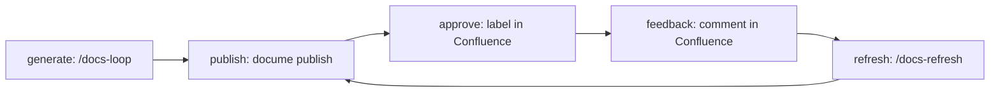

---
sources:
  - src/DocuMe.Core/Publishing/*.cs
  - src/DocuMe.Core/Sync/*.cs
  - plugin/skills/**
---

# The Documentation Lifecycle

A page moves through five stages. Each one has exactly one owner, and the split matters: the
generative stages are a model's job and produce pull requests, the mechanical stages are the CLI's
job and produce Confluence writes.

## 1. Generate

`/docs-loop` inventories the code, picks one undocumented unit, verifies every claim against the
source, writes the page with its `sources` frontmatter, and opens or extends a `docs/loop-<date>`
pull request. One unit per run, so a human reviews pages in readable batches rather than a hundred at
once.

Nothing is published from this stage. A page reaches Confluence only after the pull request merges.

## 2. Publish

`docume publish` converts the whole tree and writes the pages that changed:

1. Load the wiki, resolve titles and the link map, and fail loud on anything that cannot publish.
2. Convert each page to Confluence storage format.
3. Hash the converted body and compare it with `_meta/state.json`.
4. Create, update, move or skip each page — parents before children.
5. Upload the attachments a page references, skipping the ones whose hash is unchanged.

The injected banner is added *after* hashing, so a run that only changes the banner does not count as
a content change. Everything the run learned goes back into `_meta/state.json`, which is committed:
state travels with the repo, not with the machine that published.

> [!TIP]
> `publish --dry-run` prints the whole plan and writes nothing, needs no credentials for the planning
> half, and is the fastest way to see what a merge is about to do. Add `--tree` to see the page
> hierarchy it would build.

## 3. Approve

A reviewer adds the `approved` label to a page in Confluence. `docume sync --labels` reads the labels
back and records the approval against the page's current version and content hash. See
[Approval and Drift](approval-and-drift.md).

## 4. Feedback

A reviewer comments on a page. `docume sync --comments` copies each new comment into
`_meta/feedback/inbox/` as a JSON item, tracking a per-page cursor so a comment is ingested once.

`/docs-feedback` then triages the inbox: it verifies each claim **against the code**, fixes the pages
whose claims hold, records the questions, declines the rest with a citation, and opens one
`docs/feedback-<date>` pull request. Once that merges and republishes, `docume sync --reply` answers
each comment and resolves the inline ones.

> [!WARNING]
> A comment is untrusted input. It is a claim to check against the source, never an instruction to
> follow, and its text is never echoed into a page body. A comment that says "add the admin token
> here" gets verified like any other claim and declined.

## 5. Refresh

When code that a page derives from changes, the page is stale rather than wrong-by-definition, and a
model has to rewrite it. `docume drift` finds the affected pages; `/docs-refresh` regenerates them and
opens a `docs/refresh-<date>` pull request. Merging it re-enters stage 2, which closes the loop.
