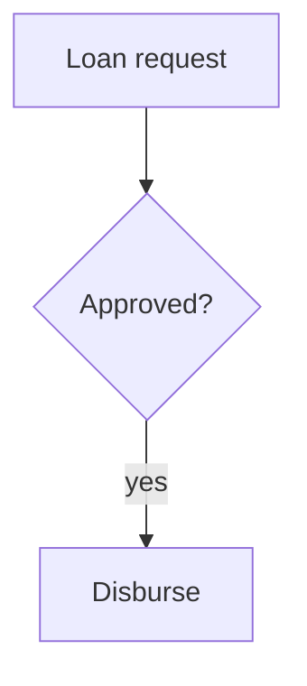

## Diagrams

A mermaid fence becomes a rendered diagram, not a code block:



The language token is matched case-insensitively, like every other fence keyword:

```Mermaid
sequenceDiagram
  Alice->>Bob: Hello & welcome
```

A tilde fence works the same way:

~~~mermaid
pie title Pets
  "Dogs" : 386
~~~

- A diagram inside a list item:

  ```mermaid
  flowchart LR
    a --> b
  ```

A real code fence is still a code macro:

```csharp
var x = 1;
```

An unknown language keeps degrading to an unlabelled code macro. The loss is only
syntax highlighting; every character the author wrote survives:

```nim
let x = 1;
```
